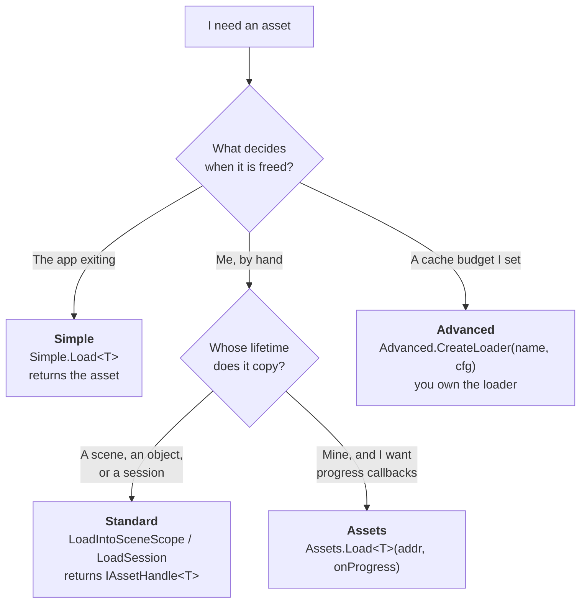
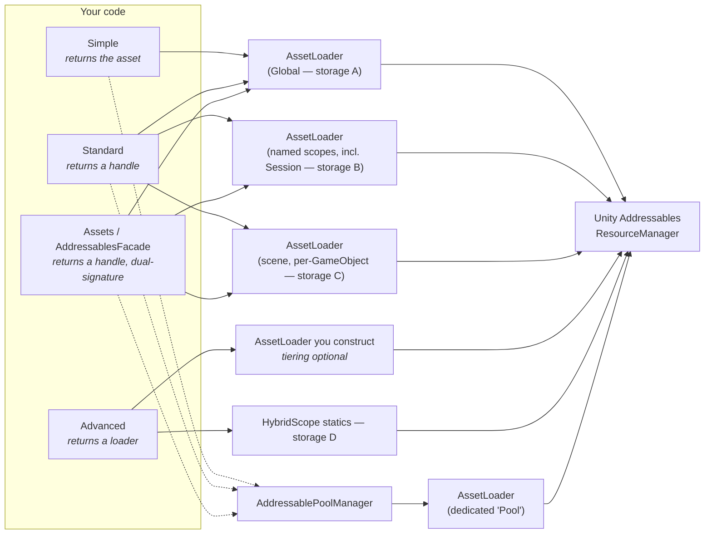
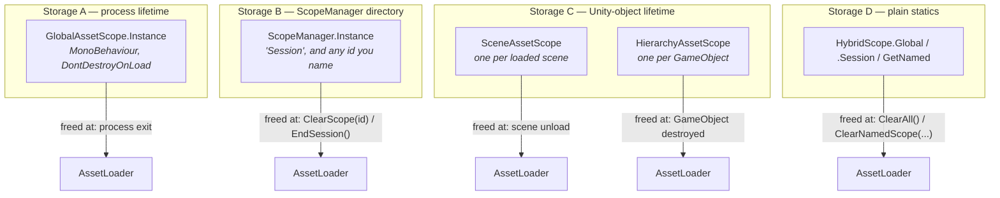

# Addressable Manager

[](CHANGELOG.md)
[](#requirements)
[](#requirements)
[](LICENSE.md)

A layer over Unity Addressables that adds three things Addressables leaves to you: **scoped
lifetimes** (assets released when the thing that needed them dies), **reference-counted handles**
(so two systems can hold the same asset without fighting), and a **CDN pipeline** (build, publish,
boot against a remote catalog, download with typed errors).

The API comes in three tiers. `Simple` for prototyping, `Standard` for shipping, `Advanced` when you
need to own the machinery. You can mix them; they share the same caches.

---

## 📋 Table of contents

- [🧭 Orientation](#-orientation)
  - [Where to start](#where-to-start)
  - [Maturity by area](#maturity-by-area)
- [🚀 Getting started](#-getting-started)
  - [Requirements](#requirements)
  - [Add the package](#add-the-package)
  - [Quick start](#quick-start)
  - [Choosing a tier](#choosing-a-tier)
- [🎯 The three tiers](#-the-three-tiers)
  - [Simple — no handle to manage](#simple--no-handle-to-manage)
  - [Standard — you own the handle](#standard--you-own-the-handle)
  - [Advanced — you own the loader](#advanced--you-own-the-loader)
  - [Assets — the dual-signature facade](#assets--the-dual-signature-facade)
  - [Which tier owns what](#which-tier-owns-what)
- [⏳ Task or UniTask](#-task-or-unitask)
  - [How the switch works](#how-the-switch-works)
  - [Which APIs are dual-signature](#which-apis-are-dual-signature)
- [🔐 Ownership and lifetime](#-ownership-and-lifetime)
  - [The one rule](#the-one-rule)
  - [Reference counting](#reference-counting)
  - [Eviction is not release](#eviction-is-not-release)
  - [Smart handles](#smart-handles)
- [📂 Scopes](#-scopes)
  - [Four independent storages](#four-independent-storages)
  - [Global scope](#global-scope)
  - [Named scopes and sessions](#named-scopes-and-sessions)
  - [Scene scope](#scene-scope)
  - [Per-GameObject scope](#per-gameobject-scope)
  - [Hybrid scopes](#hybrid-scopes)
- [🧠 Tiered caching](#-tiered-caching)
  - [Tiering is a setting on AssetLoader](#tiering-is-a-setting-on-assetloader)
  - [Presets and configuration](#presets-and-configuration)
  - [Pinning](#pinning)
  - [Reading the stats](#reading-the-stats)
  - [A caveat on byte accounting](#a-caveat-on-byte-accounting)
  - [What drives evaluation and eviction](#what-drives-evaluation-and-eviction)
- [🧵 Threading](#-threading)
  - [Main thread only, by default](#main-thread-only-by-default)
  - [ThreadSafeAssetLoader](#threadsafeassetloader)
  - [ThreadSafeCacheManager's two groups](#threadsafecachemanagers-two-groups)
- [🏊 Object pooling](#-object-pooling)
  - [Creating a pool](#creating-a-pool)
  - [Spawn versus SpawnAsync](#spawn-versus-spawnasync)
  - [Dynamic pools](#dynamic-pools)
  - [Clearing a pool](#clearing-a-pool)
  - [Custom pool backends](#custom-pool-backends)
  - [What a scene load does to a pooled instance](#what-a-scene-load-does-to-a-pooled-instance)
- [🌐 CDN content delivery](#-cdn-content-delivery)
  - [What the CDN layer does](#what-the-cdn-layer-does)
  - [The CDN settings asset](#the-cdn-settings-asset)
  - [The boot sequence](#the-boot-sequence)
  - [Downloading content](#downloading-content)
  - [The error model](#the-error-model)
  - [Cache maintenance](#cache-maintenance)
  - [Environments, failover and tokens](#environments-failover-and-tokens)
  - [The CDN tooling lives with the other Editor tools](#the-cdn-tooling-lives-with-the-other-editor-tools)
  - [Not yet validated](#not-yet-validated)
- [📊 Progress reporting](#-progress-reporting)
  - [Loading with progress](#loading-with-progress)
  - [Progress trackers](#progress-trackers)
  - [Download progress](#download-progress)
- [🚨 Error handling](#-error-handling)
  - [LoadResult](#loadresult)
  - [Load error codes](#load-error-codes)
- [🔧 Editor tools](#-editor-tools)
  - [Dashboard](#dashboard)
  - [The CDN Manager window](#the-cdn-manager-window)
  - [The debug settings asset](#the-debug-settings-asset)
  - [Rule automation](#rule-automation)
  - [Version filtering](#version-filtering)
  - [Layout Rule Editor and Layout Viewer](#layout-rule-editor-and-layout-viewer)
  - [Menu reference](#menu-reference)
  - [Command line for CI](#command-line-for-ci)
- [🔀 Migrating from 4.0.x](#-migrating-from-40x)
  - [Tiering as configuration](#tiering-as-configuration)
  - [Release and scope renames](#release-and-scope-renames)
  - [Downloads move to CdnManager](#downloads-move-to-cdnmanager)
  - [Other deprecations](#other-deprecations)
  - [Removed in 4.0.0](#removed-in-400)
- [🚧 Known inert surfaces](#-known-inert-surfaces)
- [🧪 Tests](#-tests)
  - [Running them](#running-them)
  - [What is covered](#what-is-covered)
- [📖 Documentation and samples](#-documentation-and-samples)
  - [Guides](#guides)
  - [Samples](#samples)
- [📄 License](#-license)

---

## 🧭 Orientation

### Where to start

| If you want to… | Go to |
| :-- | :-- |
| Load one asset and move on | [Quick start](#quick-start) |
| Understand which tier to use | [Choosing a tier](#choosing-a-tier) |
| Stop leaking assets | [Ownership and lifetime](#-ownership-and-lifetime) |
| Free an asset you loaded | [Eviction is not release](#eviction-is-not-release) |
| Pool prefabs | [Object pooling](#-object-pooling) |
| Point the game at your CDN | [The CDN settings asset](#the-cdn-settings-asset) |
| Turn on verbose logging | [The debug settings asset](#the-debug-settings-asset) |
| Automate addresses at import | [Rule automation](#rule-automation) |
| Run something in CI | [Command line for CI](#command-line-for-ci) |
| Upgrade from 4.0.x | [Migrating from 4.0.x](#-migrating-from-40x) |

### Maturity by area

Honest state of each area, because a README that hides this costs more than one that admits it.

| Area | State |
| :-- | :-- |
| Loading, scopes, handles, reference counting | Shipping. Reworked in `4.1.0-pre.6`; covered by the EditMode suite |
| Object pooling | Shipping. 22 defects fixed in `4.1.0-pre.7`; covered by `PoolingRegressionTests` |
| Tiered caching | Shipping, **off by default**. Byte accounting relies on a Profiler call that is [unverified in non-development builds](#a-caveat-on-byte-accounting) |
| CDN build pipeline, runtime, downloads, cache | Complete, and verified against a local `HttpListener` |
| CDN on real devices / a real CDN / staging soak | **Never done.** See [Not yet validated](#not-yet-validated) |
| Rule automation, Layout Rule Editor | Shipping. Reworked in `4.1.0-pre.6`; one setting on `LayoutRuleData` is [inert](#-known-inert-surfaces) |
| `PoolConfiguration` asset | **Inert.** Read by nothing. See [Known inert surfaces](#-known-inert-surfaces) |
| `TieredAssetLoader` | **Deprecated** in `4.1.0-pre.7`, removed in 5.0.0. See [Migrating](#-migrating-from-40x) |

---

## 🚀 Getting started

### Requirements

| Requirement | Version | Notes |
| :-- | :-- | :-- |
| Unity | **2023.1 or newer** | This floor is set by `com.unity.addressables` 2.9.1, which declares `unity: 2023.1` itself. It **cannot be lowered** while that dependency stands. |
| `com.unity.addressables` | **2.9.1** | Exactly this. 2.3.1 does not compile this package. Resolved automatically by UPM. |
| `com.unity.textmeshpro` | 3.0.6 | Declared as a dependency, so UPM installs it. The code that uses it is gated behind `TMP_PRESENT` and is limited to `AddressableProgressBar`. |
| UniTask (`com.cysharp.unitask`) | 2.3.0+ | **Optional.** Not a declared dependency. When present, `UNITASK_PRESENT` is defined and much of the async surface returns `UniTask<T>` instead of `Task<T>`. See [Task or UniTask](#-task-or-unitask). |

### Add the package

Package Manager → **Add package from git URL**, pinned to a tag:

```text
https://github.com/TeamAcMong/Addressable-System.git#4.2.2
```

Or in `Packages/manifest.json`:

```json
{
  "dependencies": {
    "com.game.addressables": "https://github.com/TeamAcMong/Addressable-System.git#4.2.2"
  }
}
```

Always pin to a tag. Tracking a branch means a `git pull` can change your API surface.

### Quick start

```csharp
using UnityEngine;
using AddressableManager.API;

public class TitleMusic : MonoBehaviour
{
    private const string Address = "Audio/TitleTheme";

    [SerializeField] private AudioSource _source;

    private async void Start()
    {
        // Simple.Load returns the asset itself, not a handle. The Global cache keeps it
        // alive until you call Simple.ReleaseAddress or Simple.ClearAll.
        var clip = await Simple.Load<AudioClip>(Address);
        if (clip == null) return;    // null is the only failure signal on this tier

        _source.clip = clip;
        _source.Play();
    }

    private void OnDestroy()
    {
        // Safe during application quit: every Simple.* member checks the singleton first.
        // Nothing else releases this — Simple never frees anything on its own.
        Simple.ReleaseAddress(Address);
    }
}
```

That is the whole thing for a prototype. For shipping code, read [Ownership and
lifetime](#-ownership-and-lifetime) — it is short, and it is the difference between a build that
holds steady and one that climbs until it dies.

### Choosing a tier



---

## 🎯 The three tiers



Namespaces: `Simple` / `Standard` / `Advanced` are `AddressableManager.API`. `Assets` and
`AddressablesFacade` are `AddressableManager.Facade`. The storage letters are the four independent
caches — they share no state, and which one a call reaches is the subject of
[Four independent storages](#four-independent-storages).

### Simple — no handle to manage

`Simple` hands you the asset and keeps the reference itself, in the Global cache, until you evict it
by address or clear the lot. Every member is null-guarded against application shutdown, which makes
it the only tier safe to call from `OnDestroy` during quit.

```csharp
using UnityEngine;
using AddressableManager.API;

var sprite = await Simple.Load<Sprite>("UI/Icon");          // the Sprite, or null
var (data, ok) = await Simple.TryLoad<TextAsset>("Config"); // the only member that catches

var enemy = await Simple.Spawn("Enemies/Orc", Vector3.zero); // Addressables-tracked instance
Simple.Destroy(enemy);                                       // correct for Spawn and Pool output

Simple.ReleaseAddress("UI/Icon");   // evict one address
Simple.ClearAll();                  // evict the whole Global cache

bool cached = Simple.IsLoaded<Sprite>("UI/Icon");  // exact (address, type) key — prefer this
var (assets, pooled) = Simple.GetStats();
```

> **`Simple.Release<T>(asset)` is `[Obsolete]` and released nothing even before that.** An asset
> instance cannot be mapped back to the cache entry holding it — the cache is keyed by
> `(address, Type)` with no reverse map. It logs one warning per process and returns.
> `Simple.ReleaseAddress(string)` is the real thing. It is deliberately *not* an overload named
> `Release(string)`, because a non-generic `Release(string)` out-ranks `Release<T>` in overload
> resolution and would silently re-bind existing `Simple.Release(someString)` call sites — turning a
> no-op into a real unconditional eviction with no diagnostic.

> **`Simple.PreloadBatch` warms the wrong key.** It loads each address as `object`, and the cache is
> keyed by `(address, Type)` — so a later `Simple.Load<Sprite>(addr)` misses and loads again.
> `Standard.PreloadAsync` has the same shape. Both are also sequential, not parallel.

### Standard — you own the handle

`Standard` returns `IAssetHandle<T>`. You dispose it; the cache keeps its own separate reference, so
disposing yours never yanks the asset out from under another system.

```csharp
using UnityEngine;
using AddressableManager.API;
using AddressableManager.Core;   // IAssetHandle<T>, LoadResult<T>

// The handle is yours — `using` releases your reference at end of scope.
using (var handle = await Standard.LoadGlobal<Sprite>("UI/Badge"))
{
    if (handle != null && handle.IsValid)
        image.sprite = handle.Asset;
}

// When a miss is expected rather than exceptional, use the Result form.
var result = await Standard.LoadSafe<Sprite>("UI/Optional");
if (result.IsSuccess)
{
    using var optional = result.Value;
    Debug.Log(optional.Asset.name);
}
else
{
    Debug.LogWarning($"[{result.ErrorCode}] {result.Error.Message}\nHint: {result.Error.Hint}");
}

// Batch and label loads: you own every handle that comes back.
var byLabel = await Standard.LoadByLabel<AudioClip>("music");
var batch   = await Standard.LoadBatch<Sprite>("UI/A", "UI/B", "UI/C");
```

> `Standard.LoadBatch` is **sequential, not parallel**, and silently omits addresses that failed —
> the dictionary it returns is your only failure signal. `Standard.LoadSmart` returns **null** when
> the underlying load returned null.

> **`Standard.*` is not shutdown-safe.** It dereferences `AddressablesFacade.Instance`, and that
> getter refuses by design to build a replacement facade once `AddressableRuntime.IsShuttingDown` is
> set — so once the live one has been torn down it hands back `null`, and a `Standard` load from a
> teardown callback during quit throws a `NullReferenceException`. Guard with
> `AddressablesFacade.HasInstance`, or use `Simple` there.

### Advanced — you own the loader

`Advanced` hands you objects whose lifetime is yours to manage. This is where tiering, threading and
custom pool managers live.

```csharp
using UnityEngine;
using AddressableManager.API;
using AddressableManager.Core;      // TieredCacheConfig, TieredCacheStats
using AddressableManager.Loaders;   // AssetLoader
using AddressableManager.Threading; // ThreadSafeAssetLoader

public sealed class BattleAssets : MonoBehaviour
{
    private AssetLoader _loader;          // we create it, so we dispose it
    private ThreadSafeAssetLoader _bg;

    private async void Awake()
    {
        // Two-argument overload turns tiering ON. CreateLoader("Battle") is a DIFFERENT
        // overload that leaves tiering off, and CreateLoader("Battle", null) throws.
        _loader = Advanced.CreateLoader("Battle", TieredCacheConfig.Aggressive);   // 50 MB cap

        // Pinning before the asset exists works — the request is remembered and applied on insert.
        Advanced.PinAsset<Texture2D>(_loader, "Boss/Diffuse");

        var result = await Advanced.LoadWithResult<Texture2D>(_loader, "Boss/Diffuse");
        if (result.IsFailure)
            Debug.LogError($"[{result.ErrorCode}] {result.Error.Message}");

        // TieringEnabled disambiguates "tiering off" from "nothing cached" — both of which
        // read as an all-zero stats struct through the Advanced accessor.
        if (_loader.TieringEnabled)
        {
            var stats = Advanced.GetCombinedCacheStats(_loader);
            Debug.Log($"hot {stats.HotEntries} / warm {stats.WarmEntries} / cold {stats.ColdEntries}, " +
                      $"hit rate {stats.HitRate:P1}, evictions {stats.TotalEvictions}");
        }

        _bg = Advanced.CreateThreadSafeLoader("Background");
    }

    private void OnDestroy()
    {
        // The owner disposes, and only from its own teardown callback.
        _loader?.Dispose(); _loader = null;
        _bg?.Dispose();     _bg = null;
    }
}
```

> **`Advanced.CreateCacheConfig` can build a config that makes `Advanced.CreateLoader` throw.** It
> exposes 5 of `TieredCacheConfig`'s 12 fields and never calls `Validate()`.
> `PromoteToWarmThreshold` is not settable and defaults to `5.0f`, while `Validate()` enforces
> `PromoteToHotThreshold > PromoteToWarmThreshold` — so `CreateCacheConfig(promoteToHotThreshold:
> 3.0f)` returns happily and the next `CreateLoader(name, cfg)` throws `ArgumentException`. Same
> shape for `evictionTriggerRatio: 0.5f` against the unsettable `EvictionTargetRatio = 0.7f`. All
> four shipped presets validate.

`Advanced.GetSystemDiagnostics()` returns a `SystemDiagnostics` struct with three fields —
`HybridScopeStats HybridScopes`, `ValidationStats Validation`, `bool IsMainThread`. It is the only
aggregate diagnostics entry point on any tier, and it is honest about only two thirds of itself:
`Validation` reads all-zero for the reason in
[Known inert surfaces](#-known-inert-surfaces), because nothing reports into the validator.

> **`EnableValidation` means different things on different tiers.** `Standard.EnableValidation(mode)`
> **assigns** the mode; `Advanced.EnableValidation(mode)` **ORs it in**. `Standard.DisableValidation()`
> clears everything; `Advanced.DisableValidation(mode)` clears only the named flags. Separately, the
> validation subsystem records nothing on its own — see [Known inert surfaces](#-known-inert-surfaces).

### Assets — the dual-signature facade

`Assets` is a static facade over `AddressablesFacade`. It is fully dual-signature — [what that
means](#-task-or-unitask) — and it is where a progress-reporting load lives on the tier surface: no
member of `Simple`, `Standard` or `Advanced` takes a progress callback. Two more exist further down,
`AddressablesFacade.LoadGlobalWithProgressAsync<T>` (an instance method) and the
`ProgressiveAssetLoader` extension methods on `AssetLoader`. See
[Progress reporting](#-progress-reporting).

```csharp
using AddressableManager.Facade;   // Assets, AddressablesFacade
using AddressableManager.Progress; // ProgressInfo

using var handle = await Assets.Load<Sprite>("UI/Icon");

// The only progress-reporting load reachable from a tier.
using var big = await Assets.Load<Texture2D>("Boss/Diffuse",
    p => Debug.Log($"{p.Progress:P0} — {p.CurrentOperation}"));

await Assets.CreatePool("Enemies/Orc", preloadCount: 8, maxSize: 32);
var orc = Assets.Spawn("Enemies/Orc", spawnPoint.position, Quaternion.identity);
Assets.Despawn("Enemies/Orc", orc);
```

> `Assets.ClearCache()` clears the **Global** cache despite the unqualified name. `Assets` has no
> `Release`, `ReleaseAddress`, `IsLoaded` or `GetStats` member — the handle-releasing idiom is
> `handle.Dispose()` or a `using` block. `Assets.LoadScene<T>` loads an **asset** into the active
> scene's scope; it does not load a Unity scene, and nothing in this package does.

Anything not exposed on a tier is reachable through `AddressablesFacade.Instance.GetPoolManager()`
and the other accessors: `SpawnAsync`, `TryClearPool`, `PrewarmPool`, `TrimPool`, `RunMaintenance`,
`SweepDestroyedInstances`, `IsDynamicPool`, `GetTotalStats`, `ClearAllPools`, `GetSessionLoader`.

### Which tier owns what

| | `Simple` | `Standard` | `Advanced` | `Assets` / `AddressablesFacade` |
| :-- | :-: | :-: | :-: | :-: |
| Returns | the asset | `IAssetHandle<T>` | a loader you own | `IAssetHandle<T>` |
| Who disposes | nobody, until you evict by address | **you** | you own loader **and** handles | **you** |
| Handle-free shortcut | ✅ only tier | ❌ | ❌ | ❌ |
| Progress callback | ❌ | ❌ | ❌ | ✅ **only** here |
| `LoadResult<T>` | ❌ | ✅ `LoadSafe` | ✅ `LoadWithResult` | ❌ |
| Scene scope | ❌ | ✅ both overloads | ❌ | active-scene only on `Assets` |
| Session scope | ❌ | ✅ | ❌ | ✅ |
| Tiered caching | ❌ | ❌ | ✅ only tier | ❌ |
| Off-main-thread load | ❌ throws | ❌ throws | ✅ | ❌ throws |
| Pool auto-create | ✅ turns it on as a side effect | ❌ | ✅ explicit | ❌ |
| Safe during shutdown | ✅ | ❌ | n/a — you hold it | ❌ on `Assets`, pooling included |
| Dual-signature under UniTask | never | `LoadIntoSceneScope<T>`, both overloads | `LoadFromBackgroundThread<T>` only | ✅ all |

One footnote on that last-but-one row. Every `Assets` member — the pooling ones included — reads
`private static AddressablesFacade Manager => AddressablesFacade.Instance` with no null check, and
that getter refuses to build a replacement once `AddressableRuntime.IsShuttingDown` is set, so after
the facade's own `OnDestroy` it hands back `null`. `Assets.Despawn` from a teardown callback during
quit can therefore `NullReferenceException` exactly like a load can. The guarded members are the
facade's own instance methods, which route through `_poolManager?.`.

---

## ⏳ Task or UniTask

### How the switch works

Both assemblies declare a `versionDefines` entry: if `com.cysharp.unitask` 2.3.0 or newer is in the
project, `UNITASK_PRESENT` is defined. Dual-signature members then return `UniTask<T>`; without it
they return `Task<T>`. The call site is identical either way.

**Convention used in this document:** every example writes `await` and `var`, never a concrete
`Task<T>` or `UniTask<T>`. Those snippets compile in both configurations. Where the concrete type
matters — because a UniTask idiom will or will not compile — the surrounding text says so.

### Which APIs are dual-signature

The blanket claim "every async API returns `UniTask<T>` when UniTask is installed" is **not true of
this package**, and assuming it will cost you a compile error. Measured per file:

| Surface | Dual-signature | Frozen at `Task<T>` |
| :-- | :-- | :-- |
| `AssetLoader`, `ThreadSafeAssetLoader`, `MonitoredAssetLoader` | all async members | — |
| `AddressablesFacade`, `Assets` | all async members | — |
| `AddressablePoolManager` (`CreatePoolAsync`, `CreateDynamicPoolAsync`, `SpawnAsync`) | all | — |
| `CdnManager` and every CDN service | all | — |
| `AssetHandleExtensions`, `ProgressiveAssetLoader` | all | — |
| `Standard` | `LoadIntoSceneScope<T>` (both overloads) only | every other async member |
| `Advanced` | `LoadFromBackgroundThread<T>` only | `CreateDynamicPool`, `LoadWithResult`, `LoadByLabelWithResult`, `LoadSmart` |
| `Simple` | **none** | all eight async members — five `Task`-returning, three `async void` |
| `TieredAssetLoader.LoadAssetAsync<T>` | — | frozen **deliberately** |

Two consequences worth internalising:

- Under UniTask, `Simple.Load<Sprite>(a)` and `Standard.LoadGlobal<Sprite>(a)` still hand you a
  `Task<T>`: both are declared `async Task<…>` and await the inner `UniTask` themselves. UniTask's
  own idioms — `.Forget()`, `.AttachExternalCancellation()`, `.Timeout()` — are extension methods on
  `UniTask` / `UniTask<T>` only, so they do not compile on either. They do compile on
  `Assets.Load<Sprite>(a)`.
- `TieredAssetLoader.LoadAssetAsync<T>` returns `Task` in **both** configurations on purpose. It is
  `[Obsolete]`, and the promise of a warning-level deprecation is that your code keeps compiling
  until 5.0.0 — a return type that changes with an unrelated package's presence would break exactly
  the callers the deprecation exists to carry. Everything else in that class's family is a plain
  inconsistency, not a design choice.

---

## 🔐 Ownership and lifetime

### The one rule

Quoted verbatim from the repository's `Documentation/LIFETIME_DESIGN.md`. That file is a design
document kept beside the project and is **not** shipped inside the package, so if you are reading
this from a UPM install you will not find it locally — the rule itself is reproduced in full here:

> **A loader belongs to exactly one owner — the object whose lifetime it copies. The owner creates
> it, the owner disposes it, and the owner disposes it only from its own teardown callback. Everyone
> else *borrows*: a borrower re-resolves the loader from its owner on every use, never caches it,
> never disposes it, and releases only the handles it personally took.**

In practice:

- `Simple`, `Standard` and `Assets` **borrow** package-owned loaders. Never dispose those.
- `Advanced.CreateLoader`, `Advanced.CreateThreadSafeLoader` and `Advanced.CreatePoolManager` **hand
  you ownership**. You dispose them, from your own `OnDestroy` / `Dispose`.
- Re-resolve `scope.Loader` at the point of use. Do not cache it in a field — the scope may have
  been torn down since.

### Reference counting

Every `IAssetHandle<T>` is born with exactly **one** reference, owned by whoever received it. A
cache holds its **own**, independent reference. So:

```csharp
using AddressableManager.Core;   // IAssetHandle<T>, AssetHandleExtensions

var handle = await Standard.LoadGlobal<Sprite>("UI/Icon");
try   { image.sprite = handle.Asset; }
finally { handle.Dispose(); }     // == Release(): a plain decrement, never a destroy
```

- `Dispose()` and `Release()` are **the same operation** on `AssetHandle<T>` — a decrement. A `using`
  block cannot destroy an asset another owner still holds.
- `Retain()` **throws** `ObjectDisposedException` at count zero. `TryRetain()` is the safe form and
  returns `false` instead.
- `IsValid` folds the count into validity, so `IsValid` and `TryRetain()` can never disagree.
- A cache's `TryGet` hands back an **already-retained** handle. Reading it and forgetting to release
  leaks one reference per hit.

> Do **not** write `handle.Retain(); … handle.Release();` as a "manual memory management" idiom. It
> is net-zero: the handle is still holding the reference it was born with, so the pair leaks exactly
> as much as doing nothing. The correct form is a single `Dispose()`.

### Eviction is not release

Two families of operation, opposite semantics, adjacent names:

| Operation | Effect |
| :-- | :-- |
| `handle.Dispose()` / `.Release()`, `TieredCache.Remove`, `ForceEviction()` | **Decrement.** Other holders keep working. |
| `Simple.ReleaseAddress`, `Simple.ClearAll`, `Standard.ClearGlobalCache`, `Standard.ClearSessionCache`, `Standard.ClearCache(scope)`, `Assets.ClearCache`, `AssetLoader.ClearCache`, `AssetLoader.ReleaseAsset`, `TieredCache.Clear`/`Dispose` | **Hard, unconditional eviction** regardless of reference count. Every handle another caller is holding reads `IsValid == false` afterwards. |

That is deliberate memory-pressure semantics, not a bug. But it means a bulk clear is a blunt
instrument: reach for handle disposal in normal flow and save the clears for real pressure.

One more asymmetry: results from `LoadAssetsByLabelAsync<T>` never enter the address cache, so
`ClearCache()` does not reach them. Only `Dispose()` on the loader does.

### Smart handles

`SmartAssetHandle<T>` wraps a handle and gives its references back on `Dispose`, with a finalizer
that warns if you forget.

```csharp
using AddressableManager.Core;    // AssetHandleExtensions, SmartAssetHandle<T>
using AddressableManager.Loaders; // AssetLoader

// autoRelease defaults to true: the wrapper TAKES OVER the reference the load handed us,
// and the using block gives it back.
using var icon = await loader.LoadAssetSmartAsync<Sprite>("UI/Icon");
if (icon != null && icon.IsValid)
    image.sprite = icon.Asset;
```

- `autoRelease: true` (the default) **takes over** your reference — do not also release the original.
- `autoRelease: false` **takes nothing** — you still owe a `Release()`.
- `Unwrap()` consumes the wrapper and transfers every owned reference back to you.
- `DisableAutoRelease()` hands the references to the caller; `EnableAutoRelease()` takes one back.

> **The implicit `T` conversion is a leak trap.** `Sprite s = await
> loader.LoadAssetAsync<Sprite>(a).ToSmart();` compiles, discards the wrapper without disposing it,
> and relies on the finalizer to notice — which logs a warning and marshals the owed release to a
> later frame. Assign the wrapper, then read `.Asset`.

---

## 📂 Scopes

A scope is a named `AssetLoader` whose lifetime is bound to something: the process, a scene, a
GameObject. When the owner dies, the loader is disposed and its cache released.

### Four independent storages

This is the single most misread part of the package. There are **four** caches, and they share no
state. Words like "Global" and "Session" appear in more than one of them.



| Reached by | Storage |
| :-- | :-- |
| `Simple.*`, `Standard.LoadGlobal`, `Assets.Load`, `AddressablesFacade.GetGlobalScope()` | **A** |
| `Standard.LoadSession`, `Assets.LoadSession`, `AddressablesFacade.GetSessionLoader()`, `ScopeManager.GetOrCreateScope(id)` | **B** |
| `Standard.LoadIntoSceneScope`, `SceneAssetScope.GetOrCreate`, `HierarchyAssetScope.AddTo` | **C** |
| `Advanced.GetHybridGlobalScope()`, `GetHybridSessionScope()`, `GetNamedScope(...)` | **D** |

`Advanced.GetGlobalScope()` and `GetSessionScope()` were renamed to `GetHybridGlobalScope()` and
`GetHybridSessionScope()` precisely so a call site cannot be misread as storage A or B. The old
names are `[Obsolete]`.

### Global scope

Process lifetime, `DontDestroyOnLoad`, scope id `"Global"`. Self-healing: it rebuilds a fresh
internal loader after `Dispose()`, so the next `Loader` read works.

```csharp
using AddressableManager.Scopes;   // GlobalAssetScope

// Instance returns null during application shutdown when none exists yet — check it.
var scope = GlobalAssetScope.Instance;
if (scope != null)
{
    using var handle = await scope.Loader.LoadAssetAsync<Sprite>("UI/Icon");
}
```

`GlobalAssetScope.HasInstance` is the non-allocating probe, but it cannot substitute for `Instance`
on a first-ever call — it requires one to already exist. `ScopeManager.GetOrCreateScope("Global")`
is **refused** (returns `null`, logs an error): the id is reserved.

### Named scopes and sessions

A "session" is a `ScopeManager` entry keyed `"Session"`. The `SessionAssetScope` *class* was removed
in 4.0.0; the API around it was kept and re-backed.

```csharp
using AddressableManager.API;
using AddressableManager.Managers;   // ScopeManager

Standard.StartSession();                                     // idempotent
using var h = await Standard.LoadSession<TextAsset>("Level1"); // auto-starts if needed
Standard.ClearSessionCache();                                // clear without ending
Standard.EndSession();                                       // disposes the loader

// Any other id you like — this is the recommended way to get an isolated cache.
var p1 = ScopeManager.Instance.GetOrCreateScope("Player1");
using var avatar = await p1.LoadAssetAsync<Sprite>("Avatars/Knight");

if (ScopeManager.Instance.HasScope("Player1"))
    ScopeManager.Instance.ClearScope("Player1");
```

`StartSession()` is idempotent, and `LoadSession` / `InstantiateSession` auto-start, so calling it
explicitly is optional.

> `ScopeManager` holds two kinds of entry. **Manager-owned** ones (from `GetOrCreateScope`) are
> cleared *and disposed* by `ClearScope`. **Foreign** ones — registered by `SceneAssetScope`,
> `HierarchyAssetScope`, `GlobalAssetScope` and `HybridScope` so they show up in the dashboard — are
> only cache-cleared, with an error logged; the loader survives, because only its real owner may
> dispose it. Ask `IsManagerOwned(id)` first if the difference matters.
> `ScopeManager.GetScopeMemoryUsage` is `[Obsolete]` and its body is `return 0;`.

`Standard.ClearCache(scopeName)` reaches exactly `ScopeManager`'s directory. It cannot reach the
pool subsystem's dedicated loader — that is deliberate, so a bulk clear cannot yank a live pool's
template prefab. Bulk-clearing pools is `AddressablesFacade.Instance.ClearAllPools()`.

### Scene scope

One per loaded scene, destroyed with it. The scope id is handle-suffixed
(`Scene-{name}#h{handle}`), so two additively loaded scenes with the same name do not collide.

```csharp
using UnityEngine;
using AddressableManager.API;
using AddressableManager.Core;

public sealed class LevelDecor : MonoBehaviour
{
    private IAssetHandle<Material> _material;

    private async void Start()
    {
        // Pass gameObject.scene. The parameterless overload binds to the ACTIVE scene,
        // which from an additively-loaded scene is one this object does not live in —
        // the material would then die when that other scene unloads.
        _material = await Standard.LoadIntoSceneScope<Material>(
            "Decor/GlowMaterial", gameObject.scene);

        if (_material != null && _material.IsValid)
            GetComponent<Renderer>().sharedMaterial = _material.Asset;
    }

    private void OnDestroy()
    {
        // We took this reference, so we give it back. The scene scope holds its own.
        _material?.Dispose();
        _material = null;
    }
}
```

This is one of only two `Standard` members that returns `UniTask` when UniTask is installed.

### Per-GameObject scope

`HierarchyAssetScope` is a component. Unity destroys it with the object, and its `OnDestroy`
disposes the loader.

```csharp
using UnityEngine;
using AddressableManager.Core;     // AssetHandleExtensions
using AddressableManager.Scopes;   // HierarchyAssetScope

public sealed class Enemy : MonoBehaviour
{
    private HierarchyAssetScope _scope;

    private void Awake() => _scope = HierarchyAssetScope.AddTo(gameObject, "Enemy:Grunt");

    private async void Start()
    {
        // Borrow the loader at the point of use; never cache it in a field.
        var loader = _scope.Loader;
        if (loader == null) return;             // already torn down

        using var icon = await loader.LoadAssetSmartAsync<Sprite>("UI/EnemyIcon");
        if (icon == null || !icon.IsValid) return;

        GetComponentInChildren<SpriteRenderer>().sprite = icon.Asset;
    }
}
```

`AddTo` returns the existing component if there is one, and **warns and ignores** a differing
`customScopeId` in that case. It returns `null` for a null target. The default scope id embeds an
instance identifier whose shape changes by Unity version — never persist or parse it.

### Hybrid scopes

`HybridScope` is a plain C# object with static singletons and a named-instance registry. It is
public, carries no `[Obsolete]`, and works.

```csharp
using AddressableManager.API;

var p1 = Advanced.GetNamedScope("Player", "Player1");
using var avatar = await p1.Loader.LoadAssetAsync<Sprite>("Avatars/Knight");

Advanced.ClearNamedScope("Player", "Player1");
Advanced.ClearAllNamedScopes("Player");
var stats = Advanced.GetHybridScopeStats();   // SingletonCount, NamedInstanceCount, TotalScopes…
```

> **Prefer `ScopeManager.GetOrCreateScope(id)` for new code.** `HybridScope` is a fourth independent
> cache with no capability the other three lack, and collapsing it onto `ScopeManager` is a planned
> change recorded in the repository's `Documentation/LIFETIME_DESIGN.md`.

> **Its self-healing is narrower than the other scopes'.** `Global`, `Session` and `GetNamed` all
> treat a disposed instance as absent and build a fresh one, so the *next* access is fine. But the
> instance you are already holding keeps throwing `ObjectDisposedException` from `.Loader` forever,
> where `GlobalAssetScope` rebuilds its internal loader behind the instance you hold. Re-resolve the
> scope, not just the loader. And `HybridScope.ClearAll()` includes the Global singleton.

---

## 🧠 Tiered caching

Entries are scored by access frequency and recency into **Hot**, **Warm** and **Cold** tiers.
Under memory pressure, cold entries go first.

### Tiering is a setting on AssetLoader

There is one loader class. Tiering is chosen by which constructor you call.

```csharp
using AddressableManager.Core;      // TieredCacheConfig
using AddressableManager.Loaders;   // AssetLoader

var plain  = new AssetLoader("Plain");                                  // tiering OFF
var tiered = new AssetLoader("Battle", TieredCacheConfig.Aggressive);   // tiering ON

// Or through the factory:
var a = Advanced.CreateLoader("Plain");                                 // OFF
var b = Advanced.CreateLoader("Battle", TieredCacheConfig.Aggressive);  // ON
```

The config parameter has **no default value**, on purpose. `CreateLoader(name, null)` throws
`ArgumentNullException`, and an invalid config throws `ArgumentException`. Tiering is immutable after
construction.

> **Tiering is OFF by default.** On `new AssetLoader(name)` the cache is unbounded, no size is ever
> estimated, and nothing is evicted. That is the right default — but do not read the presence of
> `TieredCacheStats` on a plain loader as evidence that tiering is running.

### Presets and configuration

| Preset | Cap | Behaviour |
| :-- | :-- | :-- |
| `TieredCacheConfig.Default` | 100 MB | Balanced; eviction triggers at 90 % usage, targets 70 % |
| `TieredCacheConfig.Aggressive` | 50 MB | Quicker promotion and eviction. Suits mobile |
| `TieredCacheConfig.Lenient` | 200 MB | Slower eviction. Suits desktop |
| `TieredCacheConfig.Disabled` | 0 (unlimited) | Tiering and eviction both off |

Each is a **new instance** every time you read it, so mutating one is safe. The twelve fields are
public and mutable; `Validate(out string error)` enforces `PromoteToHotThreshold >
PromoteToWarmThreshold`, `DemoteToWarmThreshold > DemoteToColdThreshold`, ratios in `[0,1]` and
`EvictionTargetRatio < EvictionTriggerRatio`.

> `TieredCacheConfig.Disabled` still reports `TieringEnabled == true`, but with
> `MaxCacheSizeBytes = 0` and both auto flags off, nothing tiers and nothing evicts. If you want
> "no tiering", use the one-argument constructor instead.

### Pinning

A pinned entry is never evicted. Pinning is order-independent — pin before the asset exists and the
request is remembered, then applied the moment the key arrives.

```csharp
loader.PinAsset<Texture2D>("Boss/Diffuse");
loader.UnpinAsset<Texture2D>("Boss/Diffuse");   // also cancels a still-pending pin
```

> On an **untiered** loader, `PinAsset` logs a warning and does nothing, and `UnpinAsset` is a silent
> no-op. Pending pins are bounded at 256; past that a pin is refused and logged. On the standalone
> caches, `TryPin` returns `false` for both "deferred" and "refused" — use `PinWithOutcome`, which
> returns `CachePinOutcome.Pinned` / `Deferred` / `Refused`, when the difference matters.

### Reading the stats

```csharp
using AddressableManager.Core;   // TieredCacheStats

// Nullable overload: null means exactly one thing — tiering is off on this loader.
TieredCacheStats? perType = loader.GetTieredCacheStats<Texture2D>();
if (perType.HasValue)
{
    var s = perType.Value;
    Debug.Log($"entries {s.TotalEntries} (hot {s.HotEntries}, warm {s.WarmEntries}, " +
              $"cold {s.ColdEntries}, pinned {s.PinnedEntries}, pending {s.PendingPins})  " +
              $"{s.TotalSizeBytes} / {s.MaxSizeBytes} bytes, usage {s.UsageRatio:P0}  " +
              $"hit rate {s.HitRate:P1}, evictions {s.TotalEvictions}");
}

// Cheap, always available, no tiering required.
var (cached, active) = loader.GetCacheStats();
```

The struct mixes two scopes, which is the easiest thing here to misread:

| Per `T` | Loader-wide |
| :-- | :-- |
| `TotalEntries`, `HotEntries`, `WarmEntries`, `ColdEntries`, `PinnedEntries`, `PendingPins`, `TotalSizeBytes` | `TotalAccesses`, `CacheHits`, `HitRate`, `TotalEvictions`, `TotalPromotions`, `TotalDemotions` |

> `Advanced.GetTieredCacheStats<T>(loader)` flattens the nullable with `?? default`, so an all-zero
> struct means either "tiering off" or "nothing of this type cached". Read `loader.TieringEnabled`
> to tell them apart, or call `loader.GetTieredCacheStats<T>()` directly for the nullable form.

### A caveat on byte accounting

Every byte figure above, and the eviction trigger that depends on them, comes from
`Profiler.GetRuntimeMemorySizeLong`. That call is documented to return 0 in non-development builds on
some platforms, and **this has not been verified against a development-stripped build of any target
platform.**

When it returns ≤ 0 the loader falls back to a per-type formula that is known to be inaccurate — an
ASTC-compressed texture can be off by an order of magnitude — kept only as the honest "no better
number available" answer rather than a fix. Prefabs are a further special case: the Profiler reports
only the native GameObject shell, so the package walks the referenced render data explicitly instead.

Treat tier sizes as an ordering signal, not as a memory budget you can hold a vendor to.

### What drives evaluation and eviction

Two things, and only two:

1. An inline trigger on the insert path, which fires while the cache is actively growing.
2. `AddressablesFacade.Update()`, which pumps every registered loader every **5 seconds** and hooks
   `Application.lowMemory` to force an eviction sweep.

> **No live `AddressablesFacade` means no periodic pump.** A project that only ever builds loaders
> directly through `new AssetLoader(...)` or `Advanced.CreateLoader(...)` and never touches the
> facade gets a tiered cache that evicts only while it is growing. Touch `Assets` or
> `AddressablesFacade.Instance` once at boot, or call `EvaluateTiers()` / `ForceEviction()` on your
> own clock.

After a CDN catalog update, cached entries for changed keys are **decremented, not hard-released** —
so a handle you are holding stays valid against the old bundle until you release it, while the next
load resolves against the new catalog. Pins survive and are re-armed. Standalone `TieredCache<T>` and
`ThreadSafeCacheManager<T>` instances are **not** reached by that sweep; clear them yourself.

---

## 🧵 Threading

### Main thread only, by default

`AssetLoader` is not thread-safe, and it does not pretend to be. **Every public method** calls a guard
first and throws `InvalidOperationException` off the main thread — every load, instantiate, release,
clear, stat, pin, and tier-evaluation call. The exceptions are `Dispose` (below), the two
constructors, the `ScopeName` and `TieringEnabled` property reads, and the static
`ClassifyErrorMessage`, none of which carry the guard.

Because `Simple`, `Standard`, `Assets`, `AddressablesFacade` and the `AssetLoader`-typed `Advanced`
members all route through it, **all of them throw off the main thread too**, `Simple.IsLoaded`
included. The exception message names the two fixes.

The pooling layer has **no** thread guard at all. Treat it as main-thread-only regardless; off-thread
it will simply fail from inside Unity instead of failing clearly.

`AssetLoader.Dispose()` is the one exception to the throwing rule: off the main thread it logs an
error and returns **without tearing down**, deliberately, because throwing would break `using` and
`finally` blocks.

### ThreadSafeAssetLoader

The only genuinely any-thread load surface. It is a dispatching wrapper: on the main thread it calls
straight through, otherwise it marshals.

```csharp
using System.Threading.Tasks;
using UnityEngine;
using AddressableManager.API;
using AddressableManager.Threading;   // ThreadSafeAssetLoader

var bg = Advanced.CreateThreadSafeLoader("Background");

// Purpose-built, and dual-signature — prefer this.
var handle = await Advanced.LoadFromBackgroundThread<Texture2D>(bg, "Terrain/Splat");
handle?.Dispose();

// Rolling your own: the lambda MUST be async. Task.Run(() => bg.LoadAssetAsync<T>(a)) is worse
// than a compile error under UniTask — it binds Task.Run<TResult>(Func<TResult>) with
// TResult = UniTask<...>, so you get Task<UniTask<...>>, and the outer await returns before the
// load has finished, dropping the handle. Without UniTask the same line binds the
// Func<Task<TResult>> overload, which unwraps — so it misbehaves in one configuration only.
await Task.Run(async () =>
{
    var h = await bg.LoadAssetAsync<Texture2D>("Terrain/Splat");
    h?.Dispose();
});

bg.Dispose();   // you created it, you dispose it
```

Two limits worth knowing: its constructor always builds an **untiered** loader, so a thread-safe
*tiered* loader cannot be constructed; and its `ClearCache`, `GetCacheStats` and `Dispose` marshal
off-thread through a **blocking** wait, bounded at 30 seconds, which throws `TimeoutException` if the
main thread never ticks and `InvalidOperationException` if no dispatcher exists.

### ThreadSafeCacheManager's two groups

`ThreadSafeCacheManager<T>` guards its state with a `ReaderWriterLockSlim`. That keeps the dictionary
consistent under concurrent access — it is **not** the same thing as being callable from any thread.
The class publishes a two-group contract:

| Group | Members | Off-thread behaviour |
| :-- | :-- | :-- |
| **Main thread only** | `Set`, `TryGet` | **Throw** `InvalidOperationException`. Both read `Time.realtimeSinceStartup` and `IAssetHandle<T>.IsValid`, which reaches the Addressables `ResourceManager`. |
| **Any thread** | `Remove`, `Clear`, `Dispose`, `Pin`/`TryPin`/`PinWithOutcome`, `Unpin`/`TryUnpin`, `ContainsKey`, `Count`, `CurrentSize`, `GetStatistics`, `ResetStatistics` | Safe. The three that give a handle back marshal the release to the next main-thread `Update()` rather than completing before returning. |

```csharp
using System.Threading.Tasks;
using AddressableManager.Core;       // ThreadSafeCacheManager<T>, IAssetHandle<T>
using AddressableManager.Threading;  // UnityMainThreadDispatcher

var cache = Advanced.CreateThreadSafeCache<Texture2D>();

await Task.Run(() =>
{
    // Any-thread group: bookkeeping only.
    int  count = cache.Count;
    long bytes = cache.CurrentSize;
    cache.Pin("Boss/Diffuse");        // works before the key is ever cached
    cache.Remove("Old/Atlas");        // release marshalled to the next Update()

    // Main-thread-only group: marshal it.
    UnityMainThreadDispatcher.Enqueue(() =>
    {
        if (cache.TryGet("Boss/Diffuse", out IAssetHandle<Texture2D> hit))
        {
            // TryGet handed back a RETAINED handle. It is ours now; give it back.
            try     { /* use hit.Asset */ }
            finally { hit.Release(); }
        }
    });
});

cache.Dispose();
```

> `Set()` on either cache **never releases the handle you passed in**. It takes its own reference via
> `TryRetain()` when it stores the entry, and leaves your reference alone on every path — including
> when the key is already cached and your handle is ignored. So the rule is uniform: **you keep your
> reference and you release it when you are done.** (A dead handle is refused rather than stored;
> `Set()` is `void`, so check `IsValid` if you need to know whether it was stored.)
> After `Dispose()` the any-thread group returns neutral values (`false`, all-zero stats, no-op)
> rather than throwing.

Also note: the standalone `TieredCache<T>` returned by `Advanced.CreateTieredCache<T>` is **not**
thread-safe at all, and no loader uses it internally any more.

---

## 🏊 Object pooling

### Creating a pool

`Spawn` is synchronous and can never wait for a load. So the first instance for an address is only
non-null if the pool already exists — which means creating it up front.

```csharp
using UnityEngine;
using AddressableManager.Facade;
using AddressableManager.Pooling;

public sealed class ProjectileSpawner : MonoBehaviour
{
    private const string Address = "Prefabs/Projectile";

    private async void Start()
    {
        // preloadCount is the only argument that instantiates anything; maxSize caps the free list.
        bool ready = await Assets.CreatePool(Address, preloadCount: 8, maxSize: 32);
        if (!ready)
            Debug.LogError($"[Spawner] No pool for {Address}; Fire() will return null.");
    }

    public void Fire(Vector3 muzzle, Quaternion aim)
    {
        // Pose is applied BEFORE SetActive(true), so OnEnable and playOnAwake VFX
        // see the muzzle rather than the last despawn site.
        var shot = Assets.Spawn(Address, muzzle, aim);
        if (shot == null) return;   // pool not ready, or shutting down
        shot.GetComponent<Projectile>()                     // Projectile is your own component
            .Launch(aim * Vector3.forward, speed: 30f);
    }

    // Always Despawn. Object.Destroy leaves the pool counting a phantom until the next
    // maintenance sweep reclaims it (and logs a warning about it).
    public void Recycle(GameObject shot) => Assets.Despawn(Address, shot);
}
```

> **`Simple.Pool(address)` returns `null` on the first call for that address**, and keeps returning
> null until the background create finishes — several frames for a real load. Not sometimes: always,
> for every new address. The null means exactly one thing, "no instance available synchronously right
> now"; failures are logged separately. It also **enables auto-create on the shared pool manager as a
> side effect**, which changes how `Assets.Spawn` and `Standard.Spawn` fail for the rest of the
> session (from an error-and-null to a silent null plus a queued create). And
> `Simple.Pool(address, position)` sets the position *after* activation, so `OnEnable` sees the
> origin — use `Assets.Spawn(address, position, rotation)` instead.

> **`maxSize` defaults disagree by tier.** `Standard.CreatePool` defaults to **50**;
> `Assets.CreatePool`, `AddressablesFacade.CreatePoolAsync`, `IPoolFactory.CreatePool` and
> `AddressablePoolManager.DefaultMaxPoolSize` all use **100**. And `maxSize <= 0` means *unlimited*
> on those creation paths, while `DynamicPoolConfig.MaxSize = 0` is **rejected** by `Validate()`.

> The `bool` from `CreatePoolAsync` is ambiguous in both directions. `true` means created, already
> existed, or lost a race. `false` means disposed manager, invalid config, failed load, or threw
> before commit — a throw *after* commit returns `true`, because the pool exists and works.

### Spawn versus SpawnAsync

| | `Spawn` | `SpawnAsync` |
| :-- | :-- | :-- |
| Blocks | never | awaits |
| Pool miss with auto-create | queues a create, returns `null` immediately | awaits the create it starts, or **joins one already in flight** for that address |
| Pool miss without auto-create | logs an error, returns `null` | resolves to `null` after the attempt |
| Dual-signature | no | yes |
| Exposed on a tier | ✅ `Simple` / `Standard` / `Assets` | ❌ **manager only** |

`SpawnAsync` is the honest answer to the first-call-null problem, and no tier exposes it. Reach it
through `AddressablesFacade.Instance.GetPoolManager()` or a manager you built yourself.

### Dynamic pools

A dynamic pool grows on demand and shrinks after an idle delay.

```csharp
using UnityEngine;
using AddressableManager.Facade;
using AddressableManager.Pooling;

public sealed class WaveDirector : MonoBehaviour
{
    private const string Enemy = "Enemies/Orc";
    private AddressablePoolManager _pools;

    private async void Start()
    {
        _pools = AddressablesFacade.Instance.GetPoolManager();

        var cfg = new DynamicPoolConfig
        {
            InitialCapacity     = 10,   // resize BUDGET only — instantiates nothing
            MinSize             = 5,    // floor for the budget, not the population
            MaxSize             = 60,   // hard cap; 0 is rejected by Validate()
            ShrinkDelaySeconds  = 20f,
            LogResizeOperations = false  // defaults to TRUE — resize spam otherwise
        };

        // preloadCount is the only argument here that creates instances.
        await _pools.CreateDynamicPoolAsync(Enemy, cfg, preloadCount: 10);
    }

    public void BeforeBigWave(int expected)
    {
        int added = _pools.PrewarmPool(Enemy, expected);   // achieved, not requested
        if (added < expected)
            Debug.Log($"[Waves] Prewarmed {added}/{expected}; capped by MaxSize.");
    }

    public void AfterWave()
    {
        var stats = _pools.GetDynamicPoolStats(Enemy);   // null for a PLAIN pool
        if (stats.HasValue)
        {
            var s = stats.Value;
            Debug.Log($"[Waves] {s.ActiveCount} out, {s.PooledCount} idle, " +
                      $"budget {s.CurrentCapacity}, peak {s.PeakActiveCount}");
        }

        // Explicit trim is NOT floored by MinSize and never touches a borrowed instance.
        Debug.Log($"[Waves] Trimmed {_pools.TrimPool(Enemy, 20)} idle instance(s).");
    }
}
```

> **`InitialCapacity`, `MinSize` and `MaxSize` create nothing.** They size the auto-resize
> *controller's budget*. A default dynamic pool reports `CurrentCapacity == 10` with **zero**
> instances, and does not grow until 8 are concurrently borrowed. `preloadCount` and `PrewarmPool`
> are the only things that instantiate. `UsageRatio` is therefore "how loaded the controller thinks
> it is", not "fraction of existing instances checked out".

Four presets, not three: `DynamicPoolConfig.Default`, `.Conservative`, `.Aggressive`, and the
factory `DynamicPoolConfig.Fixed(int size)` — which pins all three sizes, disables auto-resize, and
still creates no instances. `Fixed(0)` fails validation.

Auto-shrink needs a clock, and the clock is a maintenance pump created lazily on first pool creation
**only when `Application.isPlaying`**. It ticks once a second. Outside play mode there is no shrink,
and the only sweep is the one on scene unload. Hosts that want to own the clock call
`RunMaintenance()` themselves — it is public for that reason.

### Clearing a pool

```csharp
using AddressableManager.Facade;
using AddressableManager.Pooling;

private void OnDestroy()
{
    // Assets.* dereferences AddressablesFacade.Instance unguarded, and that can be null during
    // shutdown — check first when clearing from a teardown callback.
    if (!AddressablesFacade.HasInstance) return;

    var outcome = AddressablesFacade.Instance.GetPoolManager()?.TryClearPool("Prefabs/Projectile");
    if (outcome == PoolClearOutcome.RefusedInstancesBorrowed)
        Debug.LogWarning("Shots still borrowed; despawn them before clearing.");
}
```

`PoolClearOutcome` has four values — `Cleared`, `NoSuchPool`, `RefusedInstancesBorrowed`,
`ManagerDisposed` — specifically so "no such pool" and "refused" are distinguishable.

> **`ClearPool(address)` calls `TryClearPool` and throws the answer away.** It returns `void`, so
> shutdown code looping over addresses cannot tell that every call refused and nothing was freed —
> and "refused, still borrowed" is the *common* case. Use `TryClearPool`. For a teardown that must
> succeed, `ClearAllPools()` or `Dispose()` destroy borrowed instances too.

> **A pool's template prefab stays in memory after `TryClearPool`.** The manager releases only the
> one reference it was handed; the loader's cache keeps its own, by design — that is what makes
> recreating the same pool instant. Evicting the prefab is `AssetLoader.ClearCache()`'s job.

> **`Despawn` with the wrong address destroys the object.** `Despawn("Enemies/Orc", aGoblin)` warns
> and calls `Object.Destroy` on a healthy on-screen instance — it does correct the real owner's count
> first. Same for a double-despawn. That is a chosen policy, with the alternatives written down in the
> repository's `Documentation/LIFETIME_DESIGN.md` (not shipped in the package).

Use-after-`Dispose` has one contract across the whole pooling layer, and it never throws:

| Operation | After `Dispose` |
| :-- | :-- |
| `Get` / `Spawn` / `SpawnAsync` | `null` |
| `Release` / `Despawn` / `Clear` | no-op |
| `GetStats` | `(0, 0)` |
| `Prewarm*` / `Trim*` | `0` |
| `Create*Async` | `false` |
| `TryClearPool` | `ManagerDisposed` |

Pools are torn down while the last frame of gameplay is still running, so an
`ObjectDisposedException` there would be the wrong answer.

### Custom pool backends

Swap the backing pool implementation — for a Zenject-backed pool, say — through `IPoolFactory`.

```csharp
using AddressableManager.Facade;
using AddressableManager.Pooling;

// Affects NEW pools only — existing pools keep the adapter they were created with.
Assets.SetPoolFactory(new CustomPoolFactory());   // or your own IPoolFactory
```

Two factories ship, `UnityPoolFactory` (the default) and `CustomPoolFactory`, backed by
`UnityPoolAdapter<T>` (over `UnityEngine.Pool.ObjectPool<T>`) and `CustomPoolAdapter<T>` (a `Stack`
free list plus a `HashSet` active set). Both adapters implement all four interfaces.

| Interface | Members | What it adds |
| :-- | :-- | :-- |
| `IObjectPool<T> : IDisposable` | `Get`, `Release`, `Clear`, `GetStats` | The base contract |
| `IResizablePool<T>` | `Prewarm`, `TrimExcess` | Bulk add or evict as one step |
| `IMeasuredResizablePool<T>` | `PrewarmMeasured`, `TrimExcessMeasured` | The same, returning what was **achieved** |
| `IReclaimablePool<T>` | `ForgetActive` | "This instance is gone — stop counting it" |

Why each one is separate. `Clear()` on the base interface destroys only free-list instances, because
borrowed ones must keep counting as active. Resizing is its own interface because adding or evicting N
as one step must not disturb `activeCount` — a Get-then-Release loop is indistinguishable from real
borrows. The measured pair exists because prewarm is capped by `maxSize` and trim by the free list, and
logging the request as the outcome was the "preloaded 50/50 with ten pooled" lie. `ForgetActive` is not
`Release`: it books a corpse, it does not recycle one.

They are separate interfaces rather than members on `IObjectPool<T>` because that interface is
public and a third-party factory may already implement it; adding an abstract member would be a
source break. Consumers probe and degrade: measured → plain plus a stats delta → fallback. There is
**no shrink fallback** — a pool that is not `IResizablePool<T>` simply never shrinks.

Two adapter behaviours worth knowing: `UnityPoolAdapter.ForgetActive` **always returns `true`**
(it has no membership set, so it books a blind correction — never call it speculatively), while
`CustomPoolAdapter` returns the honest answer. `SetPoolFactory` affects **new pools only** and logs a
warning naming the count of existing pools that keep their old adapter.

`preloadCount` never fires your `onGet` callback: preload routes through `IResizablePool`, not a
Get/Release loop, so `OnEnable`/`OnDisable` do not run on preloaded instances and they never pollute
peak-active tracking.

### What a scene load does to a pooled instance

Three different answers, and this surprises people:

| Instance | Outcome on `LoadSceneMode.Single` |
| :-- | :-- |
| In the free list, default root | Lives under `DontDestroyOnLoad` `[Pools]/<address>` → **survives** |
| Borrowed, spawned with `parent: null` | Never reparented, so also under `[Pools]/<address>` → **survives, still active, still borrowed.** Loading a scene does not clean up your spawned pool objects |
| Borrowed, spawned with a `parent` (or a scene-local `poolRoot`) | Reparented into the scene → **destroyed**, then reclaimed by the maintenance sweep, which logs how many it reclaimed |

Two GameObjects appear in the hierarchy: `[Pools]` (not hidden) and `[PoolMaintenance]`
(`HideFlags.DontSave`). Both are `DontDestroyOnLoad`.

---

## 🌐 CDN content delivery

### What the CDN layer does

Everything between "I built content" and "the player's device has it":

- **Editor build pipeline** — full and update builds, content-state archival, a JSON build manifest,
  bundle-to-catalog verification, content diffs for patch sizing.
- **Runtime boot** — initialise against a remote catalog, check for updates, apply them, invalidate
  the affected loader caches.
- **Downloads** — size queries, byte-accurate progress, retry with exponential backoff and jitter,
  one automatic CRC repair, cancellation, metered-network and free-disk pre-flight.
- **Cache** — occupancy stats, obsolete-bundle cleanup, per-key and full eviction.
- **Diagnostics** — a 15-code typed error model with hints and retryability, plus a telemetry hook.
- **Tooling** — a six-tab Editor window, a local content server with fault injection, and eight
  batchmode CLI entry points.

Runtime lives in namespace `AddressableManager.Cdn` inside the main runtime assembly. Editor code is
`AddressableManager.Editor.Cdn`. Nothing in the CDN surface is `[Obsolete]`, and every async member
is dual-signature.

### The CDN settings asset

Create the settings asset via **Assets ▸ Create ▸ Addressable Manager ▸ CDN Settings**.

> It must live in a **`Resources` folder** and be named **`CdnSettings`**. It is loaded by
> `Resources.Load<CdnSettings>("CdnSettings")` — a fixed name, not a search. Rename the file and it
> is not found.

| Field | Default | Notes |
| :-- | :-- | :-- |
| `Environments` | one entry: `Local` → `http://localhost:8080` | Each has `Id`, `DisplayName`, `BaseUrl`, `FailoverUrls` |
| `DefaultEnvironmentId` | `"Local"` | Used when `InitializeAsync(null)` |
| `HostEnvironmentVariable` | **`"CDN_BASE_URL"`** | See the warning below |
| `LogUrlRewrites` | `false` | Read once, at initialisation |

`Validate()` returns **every** problem at once, and `InitializeAsync` refuses to start if there are
any. A **trailing `/`** on a base URL is a hard validation failure, not something the package trims;
so is a scheme other than `http` or `https`. Both checks are ordinal since `4.1.0-pre.9` — the scheme
is compared case-insensitively, so `HTTPS://…` is accepted, and neither check depends on the
machine's locale any more.

The asset's fifth and last field is `DownloadPolicy`, a nested block of five fields of its own. Two of
those five are wired to nothing:

| `DownloadPolicy` field | Default | Honoured? |
| :-- | :-- | :-- |
| `RequireUnmeteredNetwork` | `false` | ✅ |
| `TimeoutSeconds` | 30 | ✅ applied to each web request |
| `ReachabilityWaitSeconds` | 0 | ⚠️ read only by `NetworkPolicy.WaitForReachableAsync`, which no package code path calls |
| `MaxRetries` | 3 | ❌ **inert** |
| `MaxConcurrentDownloads` | 6 | ❌ **inert** |

> **`MaxRetries` and `MaxConcurrentDownloads` are serialized, inspector-visible, and read by
> nothing.** `CdnManager` hard-codes `RetryPolicy.Default` (which is 3 retries, 1 s base delay, 30 s
> cap, equal jitter), and concurrency is whatever Addressables does. To change retry behaviour you
> must construct your own `DownloadService` with a `RetryPolicy`. Their tooltips still say "Phase 3 —
> not yet applied", which is now stale in the other direction: Phase 3 shipped and did not wire them.

> **`HostEnvironmentVariable` defaults to `"CDN_BASE_URL"`, not empty — and when that variable is
> set, runtime environment switching stops working.** `CdnManager` wraps the rewriter in an override
> whose `SetEnvironment` and `PromoteFailover` both return failure *by design*
> ("the base URL is pinned by an environment variable to …"), and `CurrentEnvironmentId` becomes
> `"<id>-override"`. Editor and standalone only — mobile and console have no process environment. A
> stale `CDN_BASE_URL` in a developer's shell silently pins them.

### The boot sequence

```mermaid
sequenceDiagram
    participant Game
    participant CdnManager
    participant Catalog as CatalogService
    participant Loaders as AssetLoader caches

    Game->>CdnManager: InitializeAsync(environmentId)
    Note over CdnManager: Load settings → Validate →<br/>NetworkPolicy → HostRewriter →<br/>env-var override → install request decorator
    CdnManager->>Catalog: InitializeAsync
    Catalog-->>CdnManager: CdnResult&lt;bool&gt;
    CdnManager-->>Game: CdnResult&lt;bool&gt;

    Game->>CdnManager: CheckForUpdateAsync()
    CdnManager->>Catalog: CheckForUpdateAsync
    Catalog-->>CdnManager: CdnResult&lt;CatalogUpdateInfo&gt;
    CdnManager-->>Game: CdnResult&lt;CatalogUpdateInfo&gt;
    Note over Game: Offline is a SUCCESS with<br/>WasOfflineFallback == true

    Game->>CdnManager: ApplyUpdateAsync(update)
    CdnManager->>Catalog: UpdateCatalogs
    Catalog->>Loaders: InvalidateAll(changed keys)
    CdnManager->>CdnManager: CacheService.CleanObsoleteAsync
    CdnManager-->>Game: CdnResult&lt;IReadOnlyList&lt;string&gt;&gt;
```

`InitializeAsync` **must be the first Addressables call in the process.** Nothing else in the scene
may touch Addressables before it returns.

```csharp
using System;
using System.Threading.Tasks;
using UnityEngine;
using AddressableManager.Cdn;

public class ContentBoot : MonoBehaviour
{
    private async void Start()
    {
        try { await Boot(); }
        catch (Exception ex) { Debug.LogException(ex); }   // async void swallows otherwise
    }

    private async Task Boot()
    {
        var init = await CdnManager.InitializeAsync();   // null => default environment
        if (init.IsFailure)
        {
            switch (init.Error.Code)
            {
                case CdnErrorCode.NoContentAvailableOffline:
                    // First launch, no cache, no network. The one case that justifies a
                    // blocking screen — and it should retry on reconnect, not dead-end.
                    ShowBlockingSetupScreen();
                    return;
                case CdnErrorCode.CatalogNotFound:
                    // Reachable, but nothing published for this app version. Deploy problem.
                    Debug.LogError($"[Boot] {init.Error}");
                    return;
                default:
                    Debug.LogError($"[Boot] {init.Error}");
                    return;
            }
        }

        Debug.Log($"[Boot] {CdnManager.CurrentEnvironmentId} -> {CdnManager.CurrentBaseUrl}");

        var check = await CdnManager.CheckForUpdateAsync();
        if (check.IsFailure)
        {
            // Not fatal: there is a usable catalog, we just could not ask about a newer one.
            Debug.LogWarning($"[Boot] Update check failed, continuing: {check.Error}");
            return;
        }

        if (check.Value.WasOfflineFallback)
        {
            // "Could not ask" — worth re-checking later. Distinct from "asked, nothing new".
            Debug.Log("[Boot] Offline; playing on cached content");
            return;
        }

        if (!check.Value.HasUpdate)
        {
            Debug.Log("[Boot] Content is up to date");
            return;
        }

        var apply = await CdnManager.ApplyUpdateAsync(check.Value);   // also cleans obsolete bundles
        if (apply.IsFailure)
        {
            if (apply.Error.Code == CdnErrorCode.MeteredNetworkBlocked)
                PromptForMobileDataConsent();
            else
                Debug.LogWarning($"[Boot] Update failed, staying on current content: {apply.Error}");
            return;
        }

        Debug.Log($"[Boot] Applied {apply.Value.Count} catalog(s)");
    }

    private void ShowBlockingSetupScreen() { }
    private void PromptForMobileDataConsent() { }
}
```

> **Offline is a *success* on `CheckForUpdateAsync`**, with `HasUpdate == false` and
> `WasOfflineFallback == true`. Code that branches only on `IsSuccess` and `HasUpdate` treats "could
> not ask" as "nothing new" and never re-checks. `WasOfflineFallback` is the only signal, and it also
> fires when the connection drops *between* the reachability check and the request.

> **`CdnManager.Reset()` cannot be followed by `InitializeAsync()` in the same domain.** `Reset()`
> uninstalls the request decorator; the next `Install()` therefore skips its idempotent early return,
> finds that Addressables has already loaded a locator, and fails. `Reset()` is for tests and domain
> reloads, not for re-booting a running process.

### Downloading content

```csharp
using System;
using System.Threading;
using UnityEngine;
using UnityEngine.AddressableAssets;
using AddressableManager.Cdn;
using AddressableManager.UI;   // AddressableProgressBar

public class ChapterDownloader : MonoBehaviour
{
    [SerializeField] private AddressableProgressBar _bar;
    private readonly CancellationTokenSource _cts = new CancellationTokenSource();

    public async void DownloadChapter(bool playerAgreedToMobileData)
    {
        var request = new DownloadRequest(
            keys:                 new object[] { "chapter-2", "chapter-2-audio" },
            mergeMode:            Addressables.MergeMode.Union,
            minFreeDiskBytes:     128L * 1024 * 1024,   // headroom left free AFTER the download
            allowMeteredOverride: playerAgreedToMobileData);

        // Zero is a real answer ("already cached"), which is why this is CdnResult<long>.
        var size = await CdnManager.GetDownloadSizeAsync(request, _cts.Token);
        if (size.IsFailure) { Debug.LogError(size.Error); return; }
        if (size.Value == 0) { Debug.Log("Already cached"); return; }

        Debug.Log($"Need {size.Value:N0} bytes");

        // DownloadProgress is a readonly struct — this loop allocates nothing in steady state.
        var progress = new Progress<DownloadProgress>(p => _bar.SetDownloadProgress(p));

        var result = await CdnManager.DownloadAsync(request, progress, _cts.Token);

        if (result.IsCancelled)
        {
            // The partial cache is kept, so restarting resumes rather than starting over.
            Debug.Log("Cancelled by the player");
            return;
        }

        if (result.IsFailure) { HandleDownloadError(result.Error); return; }

        var report = result.Value;
        Debug.Log($"{report.BytesDownloaded:N0} B in {report.Duration.TotalSeconds:F1}s, " +
                  $"{report.Attempts} attempt(s)" +
                  (report.RepairedCorruptBundle ? ", repaired a corrupt bundle" : ""));
    }

    private void HandleDownloadError(CdnError error)
    {
        switch (error.Code)
        {
            case CdnErrorCode.MeteredNetworkBlocked:
                AskToUseMobileData();     // then retry with allowMeteredOverride: true
                break;
            case CdnErrorCode.InsufficientDiskSpace:
                ShowMessage(error.Hint);  // the hint carries the figure
                break;
            case CdnErrorCode.BundleNotFound:
                // Not retryable: the catalog references content that was never uploaded.
                Debug.LogError($"Broken deploy: {error}");
                break;
            default:
                Debug.LogError(error);    // ToString() prints code, HTTP status, URL, hint
                break;
        }
    }

    private void AskToUseMobileData() { }
    private void ShowMessage(string s) { }
    private void OnDestroy() => _cts.Cancel();
}
```

`DownloadRequest.For(key, allowMeteredOverride)` is the one-key shorthand. `minFreeDiskBytes`
defaults to 64 MiB.

> **Nothing you can pass in the request skips the free-disk gate.** `MinFreeDiskBytes` is only ever
> *added* to the required size — `needed = requiredBytes + request.MinFreeDiskBytes` in
> `DownloadService.RunPreflightChecks` — and no value of it is treated as a sentinel, so
> `minFreeDiskBytes: -1` lowers the requirement by one byte and the check still runs. The gate is
> skipped only when the package cannot read the volume: `GetFreeDiskBytes()` returns `-1` for
> "unknown" and the comparison is `free >= 0 && free < needed`. `DownloadRequest`'s constructor rejects
> a null key list and validates nothing else.

> **`GetDownloadSizeAsync` fails on an empty key list** rather than returning 0 — deliberately, so a
> bad key list cannot masquerade as fully-cached content. A caller that builds keys dynamically must
> handle it.

`DownloadReport` gives you `BytesDownloaded`, `TotalBytes`, `Duration`, `Attempts` (1 means
first-time success), `RepairedCorruptBundle` and `AverageBytesPerSecond`.

### The error model

`CdnResult<T>` is neither exceptions nor sentinels. Three equivalent shapes:

```csharp
using AddressableManager.Cdn;

var size = await CdnManager.GetDownloadSizeAsync(DownloadRequest.For("boss-fight"));

if (size)                                     // implicit operator bool == IsSuccess
    Debug.Log($"{size.Value:N0} bytes");

long bytes = size.UnwrapOr(0);                // collapse, accepting the ambiguity knowingly

size.Match(                                   // or branch exhaustively
    onSuccess: b     => Debug.Log($"{b:N0} bytes to fetch"),
    onFailure: error => Debug.LogError(
        $"{error.Code} (HTTP {error.HttpStatusCode}) at {error.Url}\n" +
        $"{error.Message}\n{error.Hint}\n" +
        (error.IsRetryable ? "Retrying can help." : "Retrying cannot help.")));
```

Also available: `IsSuccess`, `IsFailure`, `Value`, `Error`, `ErrorCode`, `ErrorMessage`, `Unwrap`
(throws on failure), `UnwrapOr`, `UnwrapOrElse`, `Match`, `Map`, `FlatMap`. `CdnResult<T>` adds the
two members only a network result needs, `IsCancelled` and `IsRetryable`; otherwise it is member-for-
member the same shape as the asset-loading `LoadResult<T>` under
[Error handling](#-error-handling).

Fifteen codes, explicitly numbered — append, never renumber. The `Meaning` column is each member's
own one-line summary in the enum:

| Code | Value | Retryable by default | Meaning |
| :-- | --: | :-: | :-- |
| `None` | 0 | — | Success |
| `Offline` | 1 | ✅ | Reachability check failed. Cached content is still playable |
| `NoContentAvailableOffline` | 2 | ✅ | First install with no cache and no network: there is nothing to play |
| `MeteredNetworkBlocked` | 3 | ✅ | On a metered connection while the policy requires an unmetered one |
| `CatalogNotFound` | 10 | ❌ | 404 on the catalog or its hash file. A deploy is broken |
| `CatalogParseFailed` | 11 | ❌ | The catalog downloaded but is malformed or truncated |
| `CatalogVersionIncompatible` | 12 | ❌ | The catalog was built for a different player version |
| `BundleNotFound` | 20 | ❌ | 404 on a bundle. The catalog references content that was never uploaded |
| `BundleCrcMismatch` | 21 | ✅ | A bundle failed CRC or hash verification |
| `ServerError` | 30 | ✅ | 5xx from the origin or edge |
| `Timeout` | 31 | ✅ | The request exceeded its timeout |
| `Unauthorized` | 32 | ✅ | 401 or 403 |
| `InsufficientDiskSpace` | 40 | ✅ | Not enough disk space to cache the content |
| `Cancelled` | 50 | ❌ | The caller cancelled. Not a failure to report |
| `Unknown` | 999 | ❌ | Unmapped. Log with the full exception and treat as non-retryable |

> **"Retryable" does not mean "retry immediately".** `MeteredNetworkBlocked`, `Unauthorized`,
> `InsufficientDiskSpace` and `BundleCrcMismatch` are all retryable, but retrying without user
> consent, a refreshed token, freed disk or an eviction just fails again. The precondition is in
> `Hint`. Conversely `CatalogNotFound` and `BundleNotFound` are **not** retryable — those are broken
> deploys, and asking again returns the same 404.

> **`CdnError.HttpStatusCode == 0` means "no response", not success.** It is what you get for DNS
> failure, no route, or a transport timeout. Never test it as an OK condition.

### Cache maintenance

`ApplyUpdateAsync` already cleans obsolete bundles. These are the manual levers.

```csharp
using AddressableManager.Cdn;

CacheStats stats = CdnManager.GetCacheStats();
if (stats.IsValid)
    Debug.Log($"{stats.OccupiedBytes / (1024 * 1024)} MB at {stats.Path}");   // FreeBytes -1 = unknown

var cache = CdnManager.Cache;   // null before initialisation
if (cache != null)
{
    await cache.CleanObsoleteAsync();                        // null = keep every loaded catalog
    await cache.ClearAsync(new object[] { "chapter-1" });     // evict one key's bundles

    var wiped = cache.ClearAll();   // support action; fails honestly while any bundle is loaded
    if (wiped.IsFailure) Debug.LogWarning(wiped.Error.Hint);
}
```

> **`CacheService.BudgetExceeded` can never fire through `CdnManager`.** `CdnManager` constructs
> `new CacheService()`, whose budget defaults to `0`, and the budget check returns immediately at
> zero. There is no `CdnManager` API to set one. Subscribing to `CdnManager.Cache.BudgetExceeded`
> compiles, looks right, and does nothing. To use it, construct your own `CacheService(budgetBytes)`.

### Environments, failover and tokens

```csharp
using AddressableManager.Cdn;

var switched = CdnManager.SetEnvironment("Staging");   // synchronous; Value is the resolved base URL
if (switched.IsFailure) Debug.LogError(switched.Error);

var next = CdnManager.PromoteFailover();   // advances one failover origin
if (next.IsFailure) Debug.LogError("Failover origins exhausted");

Debug.Log(CdnManager.NetworkState);   // Offline / Unmetered / Metered
```

Switching affects URLs resolved from that point on; bundles already cached are not re-fetched.

Auth headers go through a provider you set **before** `InitializeAsync` — the delegate is captured at
install time, so setting it afterwards has no effect. The *invocation* is per-request, so a refreshed
token from the same delegate is picked up.

Return the **raw token**. The decorator writes the header as `Bearer {token}` itself, so a provider
that returns `"Bearer …"` produces `Authorization: Bearer Bearer …`.

```csharp
CdnManager.AuthTokenProvider = () => MyAuth.CurrentToken;   // raw token, no "Bearer " prefix
await CdnManager.InitializeAsync();
```

> **This delegate runs inside Addressables' update loop.** `WebRequestOverride` is invoked from
> within `ResourceManager.Update`, so the provider is called from there too — on every bundle,
> catalog and hash request. It must **return a token it already holds**: no `WaitForCompletion()`, no
> blocking on a `Task` or coroutine, no starting or awaiting an Addressables operation. Each of those
> re-enters the update loop and Unity throws `Reentering the Update method is not allowed` from a
> stack that names only Unity's own frames — never the delegate that caused it. Even a non-re-entrant
> blocking call stalls every download while it runs.
>
> Refresh the token on your own schedule, cache it in a field, and let the provider return that
> field. Since `4.1.0-pre.11` a provider that throws is caught, named in the log, and the request
> continues without the header — an ordinary 401 instead of an exception thrown through the middle of
> Addressables' update.

Base URLs support `{platform}` and `{appVersion}` tokens. Since `4.1.0-pre.9` both detection and
substitution are case-insensitive, so `{Platform}` and `{PLATFORM}` expand like the lowercase form
rather than travelling on as literal braces.

> **`{platform}` does not expand to Unity's platform name.** It reproduces the **`BuildTarget` enum
> name** — `StandaloneWindows64`, `StandaloneOSX`, `StandaloneLinux64`, `Android`, `iOS`, `WebGL`,
> `PS4`, `PS5`, `XboxOne`, `Switch` — because that is what the Addressables `[BuildTarget]` profile
> variable bakes into the folder layout. 32-bit Windows cannot be distinguished from 64-bit at
> runtime, so 64-bit is assumed, and an unmapped platform logs an error and returns a
> wrong-but-plausible name. **If your environments differ only by host, do not use the token at all.**

A telemetry hook exists, `ICdnTelemetry` behind `CdnDiagnostics.Sink`, with methods for operation
start/success/failure and download completion. Sink calls are exception-guarded.

> **Nothing in the package calls `CdnDiagnostics`.** Wiring a sink today produces no events. Treat it
> as a hook *you* call from your own code, not as instrumentation already in place.

### The CDN tooling lives with the other Editor tools

The two things you drive this layer *with* are documented alongside the rest of the Editor surface,
because that is where you go looking for a window or a batchmode command:

- **[The CDN Manager window](#the-cdn-manager-window)** — six tabs: validator, local server, update
  preview, build, catalog inspector, runtime monitor.
- **[Command line for CI](#command-line-for-ci)** — the eight CDN `-executeMethod` entry points, next
  to the five rule-automation ones, since a CI job usually wants both.

### Not yet validated

Quoted from the changelog for `4.1.0-pre.4`, and still true at `4.1.0-pre.10`:

> Phase 5's field validation: no device matrix, no staging soak, no measurement against a real CDN,
> and the CI workflows have never run. Three Phase 3 measurements are also unrun — cancel-and-resume,
> speed accuracy under throttling, and the allocation check — each needing test infrastructure rather
> than code. The six tabs build and reach correct conclusions in batchmode; nobody has looked at them.

The automated evidence for the CDN layer is ten PlayMode integration tests across three fixtures, all
against a local `HttpListener` and asserted against the *server's* request log — because Addressables
in Fast Mode reports success without a byte crossing HTTP — plus 53 EditMode cases over catalog
parsing, retry and error mapping, the build snapshot, and URL token and scheme comparison. Every one
of them is local. If you are the first to run this against a real CDN, expect to find something.

---

## 📊 Progress reporting

### Loading with progress

Three surfaces report load progress. `Assets` is the one to reach for, because it is the only one on a
tier or a static facade:

```csharp
using AddressableManager.Facade;
using AddressableManager.Progress;   // ProgressInfo

using var handle = await Assets.Load<Texture2D>("Boss/Diffuse", p =>
{
    // ProgressInfo: Progress (0-1), CurrentOperation, BytesDownloaded,
    // TotalBytes, DownloadSpeed (KB/s), EstimatedTimeRemaining (seconds)
    Debug.Log($"{p.Progress:P0} — {p.CurrentOperation}");
});
```

The other two are `AddressablesFacade.LoadGlobalWithProgressAsync<T>` on the facade instance, and
`AddressableManager.Progress.ProgressiveAssetLoader`, whose extension methods on `AssetLoader` do the
same thing plus multi-asset variants: `LoadAssetWithProgressAsync<T>`,
`LoadMultipleWithProgressAsync<T>`, `LoadMultipleWithProgressAsyncSafe<T>` and
`DownloadWithProgressAsync`. Prefer `LoadMultipleWithProgressAsyncSafe<T>` over
`LoadMultipleWithProgressAsync<T>`: on success the `Safe` form hands you the handles, while the
non-`Safe` form disposes every one of them and returns only a `bool`, leaving each asset owned solely
by the loader's cache. On failure the `Safe` form names the failed addresses and releases *this
call's* references to the ones that succeeded.

### Progress trackers

Under the `Action<ProgressInfo>` callbacks is a small tracker abstraction, which is what the shipped
progress bar binds to. All three types are public and live in `AddressableManager.Progress`.

| Type | What it is |
| :-- | :-- |
| `IProgressTracker` | The interface every reporter implements |
| `ProgressTracker` | One operation's progress. `ProgressiveAssetLoader` constructs one per single-asset load and per download |
| `CompositeProgressTracker` | Aggregates child trackers with per-child weights, through `AddTracker(tracker, weight)` / `RemoveTracker` / `GetChildTrackers()`. `LoadMultipleWithProgressAsync*` builds one of these with a child per address |

`AddressableProgressBar.BindToTracker(IProgressTracker)` drives the component from a tracker, and its
inspector tells you to do exactly that. Alongside it the component exposes `SetProgress(float)`,
`SetDownloadProgress(DownloadProgress)`, `SetStatus(string)`, `Show()`, `Hide()` and `Reset()`.

### Download progress

CDN downloads report through `IProgress<DownloadProgress>`. `DownloadProgress` is a `readonly
struct`, so a 4 Hz progress loop allocates nothing in steady state.

`AddressableProgressBar` (namespace `AddressableManager.UI`) consumes it directly via
`SetDownloadProgress(DownloadProgress)`, and exposes a static `FormatBytes(long)` that divides by
1024 at each step while labelling the result `B` / `KB` / `MB` / `GB` — binary magnitudes under the
shorter labels, deliberately, so a figure here reads the same as the one on a platform storage screen.

> **`TotalBytes == 0` means "not known yet", not "nothing to download".** `Percent` returns `0f` in
> that state and `EtaSeconds` is `-1` for unknown, never `0`. Do not divide by `TotalBytes`; branch
> on `IsSizeKnown` and render a "calculating" state, and render an ETA of `-1` as blank rather than
> "0s left". The shipped progress bar already does both.

---

## 🚨 Error handling

### LoadResult

`LoadResult<T>` is the asset-loading counterpart to [`CdnResult<T>`](#the-error-model), for when a
miss is expected rather than exceptional.

```csharp
using AddressableManager.API;
using AddressableManager.Core;   // LoadResult<T>, LoadError, LoadErrorCode

var result = await Standard.LoadSafe<Sprite>("UI/Optional");

if (result)                                  // implicit operator bool
{
    using var handle = result.Value;
    image.sprite = handle.Asset;
}

result.Match(
    onSuccess: h     => { using (h) image.sprite = h.Asset; },
    onFailure: error => Debug.LogWarning(
        $"[{error.Code}] {error.Message}\nAddress: {error.Address}\nHint: {error.Hint}"));
```

Also available: `IsSuccess`, `IsFailure`, `Value`, `Error`, `ErrorCode`, `ErrorMessage`, `Unwrap`
(throws on failure), `UnwrapOr`, `UnwrapOrElse`, `Match`, `Map`, `FlatMap` — the same list
[`CdnResult<T>`](#the-error-model) publishes, minus its two network-only members `IsCancelled` and
`IsRetryable`. `LoadError` carries `Code`, `Message`, `Hint`, `Address` and `Exception`.

Also available: `Advanced.LoadWithResult<T>(loader, address)`,
`Advanced.LoadByLabelWithResult<T>(loader, label)`, and `AssetLoader.LoadAssetAsyncSafe<T>` /
`LoadAssetsByLabelAsyncSafe<T>` on a loader you own.

### Load error codes

| Code | Value | Meaning |
| :-- | --: | :-- |
| `None` | 0 | Success |
| `InvalidAddress` | 1 | Null, empty, or malformed |
| `AssetNotFound` | 2 | No such address in the catalog |
| `InvalidAssetReference` | 3 | Null reference or invalid runtime key |
| `InvalidLabel` | 4 | No such label |
| `OperationFailed` | 5 | Addressables reported failure |
| `LoaderDisposed` | 6 | The loader was disposed |
| `ThreadSafetyViolation` | 7 | Called off the main thread |
| `TypeMismatch` | 8 | Address exists, wrong type requested |
| `NetworkError` | 9 | Transport failure |
| `ContentNotDownloaded` | 10 | **The address is valid but the bundle is not on this device.** The one to handle in a CDN-shipping game — it means "download it", not "it does not exist" |
| `Unknown` | 999 | Unclassified |

---

## 🔧 Editor tools

### Dashboard

**Window ▸ Addressable Manager ▸ Dashboard**, or **Ctrl+Alt+A** (**Cmd+Alt+A** on macOS). That is the
only keyboard shortcut in the package.

Four tabs — **Active Assets**, **Performance**, **Scopes**, **Settings** — plus a one-row CDN status
strip above them showing environment, app version, cache size and network state, polled once a
second, with a button through to the CDN Manager window.

| Tab | Contents |
| :-- | :-- |
| Active Assets | Searchable live asset list with scope filter and count |
| Performance | Four stat cards, a memory graph, slowest-assets list, **Export Report (CSV)** |
| Scopes | One entry per live, instance-qualified scope id, with a cleanup-all button |
| Settings | Auto-refresh toggle and refresh interval — see the warning below |

> **All six controls on the Settings tab are live**: Log Level, Simulate Slow Loading,
> Delay (ms) and Failure Rate (%). They have no change callback and no reader. Only *Auto Refresh
> Dashboard* and *Refresh Interval* work, and they only change how often the window repaints.

Eight custom inspectors ship, for `AddressablePreloadConfig`, `AddressableProgressBar`,
`LayoutRuleData`, `CompositeLayoutRuleData`, `MonitoringHelper`, and the three scope components via a
shared base. `MonitoringHelper` is a scene component that marks a play session as one the Dashboard
should track; it does **not** switch the pipeline on — the Editor-side monitor registers itself
through `[InitializeOnLoad]`, and the component's own summary calls itself "mostly a discoverable
scene-level indicator of intent". The pipeline it belongs to is
[MONITORING_GUIDE.md](MONITORING_GUIDE.md). **There is no pool-manager inspector** —
`AddressablePoolManager` is a plain class, not a `MonoBehaviour`, so it cannot have one.

### The CDN Manager window

**Window ▸ Addressable Manager ▸ CDN Manager.** The window for the
[CDN layer](#-cdn-content-delivery). Six tabs, in this order — the labels below are what the tabs
actually render:

| Tab | What it does |
| :-- | :-- |
| **Validator** | Evaluates the Addressables settings contract; "Fix All" for the auto-fixable rules |
| **Server** | Starts and stops the local content server, with a live request log |
| **Update Preview** | Content-update restriction violations, plus the **Prepare for Content Update** step |
| **Build** | Drives full and update builds against a chosen CDN profile |
| **Catalog** | Three virtualised views — Entries, Bundles, Problems |
| **Runtime Monitor** | Play-mode only. Polls the live `CdnManager` once a second; buttons for check-for-update, clean obsolete, clear cache |

A local content server also has menu entries under **Tools ▸ Addressable Manager ▸ Start / Stop Local
Content Server** (default port 8080), and a fault-injection helper for testing status codes,
connection drops, throttling and latency.

> `LocalContentServer.Start(int port)` returns `void`, does not throw, and reports failure only to
> the console — check `IsRunning` afterwards. It binds `http://localhost:{port}/`, so it is **not**
> reachable from a phone on the same LAN. Access-denied on Windows needs a
> `netsh http add urlacl` entry.

> A clean **Catalog** verdict can cover less than it says. Bundles whose load path resolves to an
> unknown location are counted as *unchecked* and skipped rather than silently dropped, and the
> summary states that caveat in every branch — including the clean one.

### The debug settings asset

**Window ▸ Addressable Manager ▸ Settings** selects and pings one asset: a `DebugSettings`
`ScriptableObject`, which the package loads by the fixed path
`Resources.Load<DebugSettings>("AddressableManager/DebugSettings")`. It must therefore live at
`Resources/AddressableManager/DebugSettings`; the menu item offers to create one if it is missing
(**Assets ▸ Addressable Manager ▸ Create Debug Settings**).

Exactly one field on it is live: **`logLevel`**, and only at its `All` setting. `DebugSettings.IsVerbose`
is `logLevel == LogLevel.All`, and it gates the verbose logs in `AssetLoader` and `CdnTelemetry`. So
this asset is the package's log-level switch, and the Dashboard's *Log Level* dropdown now writes straight to it.

> **`IsVerbose` is `UNITY_EDITOR`-only and hard-`false` in a build.** Both the `Resources` lookup and
> the comparison sit behind `#if UNITY_EDITOR`; in a player, `IsVerbose` returns `false` without
> reading anything. Verbose logging is an Editor facility.

Everything else on the asset — `logToFile`, `logFilePath`, `enableProfiling`, `showProfilerOverlay`,
`recordMetrics`, the whole simulation group (`simulateSlowLoading`, `simulatedDelayMs`,
`simulateFailureRate`, `simulateNetworkConditions`, `networkSimulation`), the whole validation group
(`validateReferences`, `detectMemoryLeaks`, `leakDetectionMinutes`, `warnOnHighRefCount`,
`highRefCountThreshold`, `warnOnHighMemory`, `highMemoryThresholdMB`) and the methods `ShouldLog`,
`GetNetworkDelay` and `ShouldSimulateFailure` — has **no caller anywhere in the package**. See
[Known inert surfaces](#-known-inert-surfaces).

### Rule automation

Assign addresses, labels and versions by rule instead of by hand. Filters and providers are
`ScriptableObject` **assets** — create them from **Assets ▸ Create ▸ Addressable Manager ▸ Filters**
and **▸ Providers ▸ Address / Label / Version** (providers are nested one level deeper than filters),
or with `ScriptableObject.CreateInstance<T>()` in code. Never `new`.

**Eight filters**: `PathFilter`, `TypeFilter`, `ExtensionFilter`, `ObjectFilter`, `AddressFilter`,
`AddressableGroupFilter`, `FindAssetsFilter`, `DependentObjectFilter`.

**Eight providers**, in three families. Address: `PathAddressProvider`,
`FileNameAddressProvider`. Label: `ConstantLabelProvider`, `FolderLabelProvider`. Version:
`ConstantVersionProvider`, `DateVersionProvider`, `BuildNumberVersionProvider`,
`GitCommitVersionProvider`.

```csharp
using System.Linq;
using UnityEditor;
using UnityEngine;
using AddressableManager.Editor.Filters;
using AddressableManager.Editor.Providers;
using AddressableManager.Editor.Rules;

public static class AddressUiSprites
{
    [MenuItem("Tools/My Game/Address selected UI sprites")]
    private static void Run()
    {
        var path = ScriptableObject.CreateInstance<PathFilter>();
        path.MatchMode = PathFilter.PathMatchMode.Glob;   // ** is INERT in the default Contains mode
        path.Pattern   = "Assets/UI/**/*.png";            // anchored: must match the whole path
        path.Enabled   = true;                            // a rule needs >= 1 ENABLED filter

        var rule = new AddressRule
        {
            RuleName        = "UI Sprites by Filename",
            Enabled         = true,
            Priority        = 100,
            TargetGroupName = "UI",     // created, with schemas, if it does not exist
            SkipExisting    = false,
            AddressProvider = ScriptableObject.CreateInstance<FileNameAddressProvider>(),
        };
        rule.Filters.Add(path);         // Filters is a get-only List — add INTO it

        var ruleData = ScriptableObject.CreateInstance<LayoutRuleData>();
        ruleData.AddAddressRule(rule);

        // ApplyRules validates the WHOLE asset first and applies NOTHING if it fails.
        var problems = RuleValidator.Validate(ruleData);
        if (problems.Any(m => m.Severity == RuleValidator.ValidationSeverity.Error))
        {
            foreach (var m in problems) Debug.LogError($"[{m.Severity}] {m.Message}");
            return;
        }

        var paths = Selection.objects
            .Select(AssetDatabase.GetAssetPath)
            .Where(p => !string.IsNullOrEmpty(p) && !AssetDatabase.IsValidFolder(p))
            .ToList();

        var result = new LayoutRuleProcessor(ruleData).ApplyRulesToAssets(paths);
        Debug.Log($"{result.AddressesApplied} address(es), {result.Errors.Count} error(s)");
    }
}
```

Behaviour that is easy to get wrong:

- **`**` does nothing unless `MatchMode` is `Glob`.** The default is `Contains`, in which
  `"Assets/UI/**/*.png"` is a literal substring that matches nothing. `Glob` is deliberately the
  *last* enum member so existing serialized indices keep their meaning.
- The glob dialect is narrow and **anchored**: only `*`, `**` and `?` are special. `[abc]` character
  classes and `{wav,mp3}` brace sets are escaped into literals.
- **A rule with every filter unchecked matches nothing.** It requires at least one filter with
  `Enabled == true`. Corollary: `Invert` on a disabled filter does nothing, because a disabled
  filter returns "match" before inversion is applied.
- **Validation is an all-or-nothing gate.** One unfinished label rule blocks a perfectly good
  address rule in the same asset.
- Address rules **create** the Addressables entry; label and version rules **silently skip** assets
  that are not already addressable.
- Address and version rules are first-match-wins by descending priority. **Label rules are
  additive** — every matching rule contributes, and labels are only ever added, never replaced.
- A missing target group is **created** (with schemas attached), not reported.
- `TypeFilter` is the one filter that does not self-heal a cold cache — used outside a path that
  calls `Setup()`, it matches nothing. Four filters carry per-asset caches that `Setup()` does not
  invalidate, so two apply runs in one editor session may see stale state.
- Exported rule JSON carries three things per filter and provider: the asset *path*, the *type
  name*, and the object's own `JsonUtility` payload. `RuleSerializer` resolves by path first; when
  the path is empty or does not resolve in this project it rebuilds the type from its name, applies
  the stored payload with `JsonUtility.FromJsonOverwrite`, and adds the new instance as a sub-asset
  of the rule data. A rule set exported from another project therefore imports, but the rebuilt
  filters and providers are *copies* — they are not the exporting project's assets.
- The five shipped JSON templates use both routes. `BasicAddressRules.json` points at the five
  `.asset` files under `Editor/Templates/BasicAddressRules/`; `ComprehensiveRules.json`,
  `MaterialTextureRules.json`, `PlatformSpecificRules.json` and `VersionedAssetsRules.json` carry
  empty paths and are rebuilt from the type name plus the embedded configuration. This applies to
  address, label and version rules alike; before 4.1.0-pre.10 only address-rule filters had the
  fallback, so label and version rules in those templates imported with no filters at all.

### Version filtering

`LayoutRuleData.VersionExpression` narrows a whole apply run to assets whose existing addressables
entry carries a `version:` label inside the range. It is parsed once, before any rule runs, by
`LayoutRuleProcessor.PrepareVersionFilter`.

```bash
"$UNITY" -batchmode -quit -nographics -projectPath . -logFile - \
  -executeMethod AddressableManager.Editor.CLI.AddressableCLI.SetVersionExpression \
  -layoutRuleAssetPath "$RULES" -versionExpression "[1.0.0,2.0.0)" -excludeUnversioned true
```

`VersionExpression.TryParse` accepts exactly two shapes: a bare semantic version (`1.0.0`, read as
"this version or newer"), and a bracketed range where `[` / `]` are inclusive and `(` / `)`
exclusive. Either bound of a range may be left empty for an open end — `[1.0.0,)` is the form the
shipped `ComprehensiveRules.json` template uses.

> **The CLI's own error message lists four forms it will then reject.** On a parse failure
> All eight forms `SetVersionExpression` advertises are accepted: the three range shapes, a bare
> version (treated as an inclusive minimum), and the four comparison operators `>=1.0.0`, `>1.0.0`,
> `<=2.0.0`, `<2.0.0`. The comparison branch was added in 4.1.0-pre.10 — before that the CLI's own
> error message listed four forms its parser then rejected. `[1.0.0,)` and `[,2.0.0)` also work.

Three more behaviours to know:

- **An empty expression means no filter**, and every asset is eligible. That is the default.
- **An unparseable expression stops the run.** `PrepareVersionFilter` records the error and returns
  false, and both `ApplyRules` and `ApplyRulesToAssets` return immediately without touching an asset —
  so the error text's "No rules were applied" is accurate. Falling through instead would leave no
  filter set and apply every rule to every asset, which is the opposite of what the expression asked
  for; that is what the code did before 4.1.0-pre.10.
- **`ExcludeUnversioned` governs the three "no usable version" cases identically**: an asset that is
  not addressable yet, one whose entry carries no `version:` label, and one whose label does not
  parse as a semantic version. Set, they are skipped; clear (the default), they pass through.

### Layout Rule Editor and Layout Viewer

**Window ▸ Addressable Manager ▸ Layout Rule Editor** — rule list (Address / Label / Version tabs), a
rule detail panel, and a preview panel with a configurable limit (default 50) and a refresh button.
Toolbar: **Validate**, **Apply All**, **Import**, **Export**.

Preview shows matches for **one selected rule**, not the whole set. It counts all matches but
materialises at most the limit, and it never writes.

**Window ▸ Addressable Manager ▸ Layout Viewer** — conflict detection across groups and entries, with
search, a conflicts-only filter, and report export.

> The Layout Viewer re-scans every group and every entry **every two seconds** while open with Auto
> Refresh on. On a large project, close it when you are not using it.

> `CompositeLayoutRuleData` cannot be loaded by the Layout Rule Editor or by any CLI entry point —
> its only run path is the **Apply Combined Rules** button on its own inspector. Its
> `_respectSourceOrder` also defaults to `true`, which means `Priority` is **ignored** across a
> composite; source-file order decides.

Conflict detection returns a `SettingsNotInitialized` entry rather than an empty list when
Addressables was never set up, specifically so a `count == 0` CI gate cannot pass on an unconfigured
project. Three of its seven conflict types (`CircularDependency`, `MissingReference`,
`GroupConflict`) have no producer.

### Menu reference

| Menu | Item |
| :-- | :-- |
| **Window ▸ Addressable Manager** | Dashboard (`Ctrl+Alt+A`) · Layout Rule Editor · Layout Viewer · CDN Manager · Documentation · Settings · Clear All Caches |
| **Tools ▸ Addressable Manager** | Force Process All Assets · Batch Address Updater · Repair Groups Missing Schemas · Start / Stop Local Content Server · Quick Setup ▸ Create All Scope Objects · Quick Setup ▸ Create Sample Configs |
| **GameObject ▸ Addressable Manager** | Add Global Scope · Add Scene Scope · Add Hierarchy Scope · View in Dashboard |
| **Assets ▸ Addressable Manager** | Create Preload Config ⚠️ · Create Pool Config ⚠️ · Create Debug Settings |
| **Assets ▸ Addressables** | Apply Layout Rules |
| **Assets ▸ Create ▸ Addressable Manager** | Layout Rule Data · Composite Layout Rule Data · Preload Configuration ⚠️ · Pool Configuration ⚠️ · Debug Settings · CDN Settings · Filters ▸ (8) · Providers ▸ Address ▸ (2) · Providers ▸ Label ▸ (2) · Providers ▸ Version ▸ (4) |

⚠️ `PoolConfiguration` is read by no code at all. `AddressablePreloadConfig` is validated at build
time but never preloads anything — see [Known inert surfaces](#-known-inert-surfaces).

Three caveats:

- **Clear All Caches** clears Editor *tracking data* only. It does not touch runtime assets, the
  Addressables bundle cache, or any loader cache.
- **Documentation** looks for the README at an `Assets/` path and cannot find it in a UPM install.
  Read this file instead.
- **Batch Address Updater** opens no window — it shows a dialog listing the four methods to call
  from code: `FindAndReplace(find, replace, caseSensitive = false)`, `AddPrefix(groupName, prefix)`,
  `RemovePrefix(prefix)` and `ConvertToLowercase(groupName = null)`. `FindAndReplace` treats `find`
  as a **literal** on both paths — the case-insensitive path still goes through `Regex`, but it
  escapes the needle and doubles `$` in the replacement, so neither argument is ever read as a
  pattern or a substitution template.

### Command line for CI

Thirteen `-executeMethod` entry points in two families: **five for rule automation** and **eight for
the CDN**. Both families are documented here rather than one per chapter, because the question "what
can I run in CI" has one answer.

One thing to get right before either family: **Unity exits 0 when `-executeMethod` runs against an
assembly that did not compile**, and the method never runs. All five rule-automation entry points
check `EditorUtility.scriptCompilationFailed` themselves and exit 1; six of the eight CDN ones do,
and two do not — named under the CDN table below.

**Rule automation**

```bash
#!/usr/bin/env bash
set -euo pipefail
UNITY="/c/Program Files/Unity/Hub/Editor/2023.1.0f1/Editor/Unity.exe"
RULES="Assets/Rules/MainRules.asset"

# Unity exits 0 from -executeMethod even when the editor assembly never compiled, which is why
# all five of these re-check EditorUtility.scriptCompilationFailed and exit 1 themselves.
# Do not add `|| true` — 0, 1 and 2 mean three different things.
"$UNITY" -batchmode -quit -nographics -projectPath . -logFile - \
  -executeMethod AddressableManager.Editor.CLI.AddressableCLI.ValidateLayoutRules \
  -layoutRuleAssetPath "$RULES" -errorLogFilePath build_logs/validation.txt

"$UNITY" -batchmode -quit -nographics -projectPath . -logFile - \
  -executeMethod AddressableManager.Editor.CLI.AddressableCLI.ApplyRules \
  -layoutRuleAssetPath "$RULES" -warningAsError true -resultFilePath build_logs/addressables.json

# DetectConflicts exits 1 when it FINDS conflicts, so branch rather than letting set -e kill the job.
if ! "$UNITY" -batchmode -quit -nographics -projectPath . -logFile - \
      -executeMethod AddressableManager.Editor.CLI.AddressableCLI.DetectConflicts \
      -reportFilePath build_logs/conflicts.json; then
  echo "conflicts found — see build_logs/conflicts.json"; exit 1
fi
```

| Entry point | Arguments |
| :-- | :-- |
| `AddressableCLI.ApplyRules` | `-layoutRuleAssetPath` (required), `-validateOnly`, `-warningAsError`, `-resultFilePath` |
| `AddressableCLI.ValidateLayoutRules` | `-layoutRuleAssetPath` (required), `-errorLogFilePath` |
| `AddressableCLI.DetectConflicts` | `-reportFilePath` (default `conflicts.json`) |
| `AddressableCLI.ImportRules` | `-layoutRuleAssetPath`, `-importFilePath` (both required), `-mergeMode` |
| `AddressableCLI.SetVersionExpression` | `-layoutRuleAssetPath` (required), `-versionExpression`, `-excludeUnversioned` — see [Version filtering](#version-filtering) |

Exit codes across all five: **0** success · **1** compile failure, validation errors, or findings ·
**2** missing argument, missing asset, or exception.

> Two argument-parser traps: a value that begins with `-` is swallowed and its flag silently becomes
> `"true"`; and booleans accept only `true` (any case) or `1` — `yes`, `on` and a trailing space all
> read as `false`.

**CDN content**

Six of these eight check the compile flag in their own first statement: all three `CdnBuildCLI`
entry points (`BuildContent`, `BuildContentUpdate`, `VerifyOutput`),
`CdnSetupCLI.ApplyPhaseZeroSetup`, `CatalogInspectCLI.Inspect` and `CdnTabProbeCLI.ProbeTabs`. The
gates on the first four were added in `4.1.0-pre.9`.

> **Two do not check it:** `CdnTestContentCLI.CreateRemoteTestContent` and
> `CdnTestContentCLI.GenerateTestCorpus` — the string `scriptCompilationFailed` does not occur in
> that file. A CI job that runs either of them first sees exit 0 from a broken assembly. Put a
> compile step in front of them, or run one of the six that does check as the first Unity invocation
> in the pipeline.

> The in-assembly gate cannot cover the case it exists for, because it lives in the assembly that is
> broken. The repository (not the package) carries `ci/unity-run.sh` for that: it scans the Unity log
> for `error CS`, then for the `FAILURE:` prefix the CDN CLIs print before exiting non-zero, then
> checks the exit code, and finally checks that the artifact the step was meant to produce exists.
> It has never been run against a real Unity invocation — see [Not yet validated](#not-yet-validated).

```bash
UNITY=".../Unity.exe"
COMMON=(-batchmode -quit -nographics -projectPath . -logFile -)

# One-time project setup: profiles, contract rules, schema repair.   NOTE: -profile
"$UNITY" "${COMMON[@]}" -executeMethod AddressableManager.Editor.Cdn.CdnSetupCLI.ApplyPhaseZeroSetup \
    -profile Local

# Build.   NOTE: -cdnProfile — a DIFFERENT flag from the line above
"$UNITY" "${COMMON[@]}" -executeMethod AddressableManager.Editor.Cdn.CdnBuildCLI.BuildContent \
    -cdnProfile Staging

"$UNITY" "${COMMON[@]}" -executeMethod AddressableManager.Editor.Cdn.CdnBuildCLI.BuildContentUpdate \
    -cdnProfile Staging -contentStatePath ci/state/addressables_content_state.bin

# Verify the artifact against its manifest and the settings contract.
"$UNITY" "${COMMON[@]}" -executeMethod AddressableManager.Editor.Cdn.CdnBuildCLI.VerifyOutput \
    -cdnProfile Staging -manifest ServerData/build-manifest.json

# Refuse to upload a catalog that references bundles you do not have.
"$UNITY" "${COMMON[@]}" -executeMethod AddressableManager.Editor.Cdn.CatalogInspectCLI.Inspect \
    -catalogPath ServerData/catalog.json -bundleDir ServerData
```

| Entry point | Flags | Exit codes |
| :-- | :-- | :-- |
| `CdnSetupCLI.ApplyPhaseZeroSetup` | `-profile` (default `Local`) | 0 all rules pass · 1 a rule still fails · 2 exception |
| `CdnBuildCLI.BuildContent` | `-cdnProfile` (default `Local`) | 0 · 1 refused/failed/verification problems · 2 exception |
| `CdnBuildCLI.BuildContentUpdate` | `-cdnProfile`, `-contentStatePath` | same |
| `CdnBuildCLI.VerifyOutput` | `-cdnProfile`, `-manifestPath` **or** `-manifest` | same |
| `CatalogInspectCLI.Inspect` | `-catalogPath`, `-bundleDir` | 0 publishable · 1 not |
| `CdnTabProbeCLI.ProbeTabs` | none | Batchmode smoke check of all six tabs |
| `CdnTestContentCLI.CreateRemoteTestContent` | none | Creates a `Remote Test` group and one address |
| `CdnTestContentCLI.GenerateTestCorpus` | none | Procedural multi-group corpus for delta testing |

> **The profile flag is spelled two ways.** `CdnSetupCLI` reads `-profile`; every `CdnBuildCLI` entry
> point reads `-cdnProfile`. A copy-pasted flag silently falls back to the `Local` default rather
> than erroring.

> `CatalogInspectCLI` **reports orphan bundles but never deletes them, and they never fail the run** —
> a bundle orphaned by the newest catalog may still be referenced by an older catalog that installed
> players are running. Only missing bundles and size mismatches clear the publishable verdict. A
> catalog size of `0` is treated as "no size recorded", not as a mismatch.

---

## 🔀 Migrating from 4.0.x

Nothing in `4.1.0` breaks a `4.0.x` build. Twenty members carry `[Obsolete]` at warning level and
keep working until **5.0.0**. Each attribute message contains its own migration; the four sections
below are the same information in one place, and everything in them was deprecated in
`4.1.0-pre.7`. `Removed in 4.0.0` is for anyone arriving from 3.x.

### Tiering as configuration

`TieredAssetLoader` is a forwarder onto `AssetLoader` and is deprecated as a class.

```csharp
// BEFORE
var loader = new TieredAssetLoader("Battle", TieredCacheConfig.Aggressive);
var tex    = await loader.LoadAssetAsync<Texture2D>("Boss/Diffuse");
loader.PinAsset<Texture2D>("Boss/Diffuse");
var stats  = loader.GetCombinedStats();
var perT   = loader.GetCacheStats<Texture2D>();
loader.Dispose();

// AFTER
var loader = new AssetLoader("Battle", TieredCacheConfig.Aggressive);
var tex    = await loader.LoadAssetAsync<Texture2D>("Boss/Diffuse");
loader.PinAsset<Texture2D>("Boss/Diffuse");
var stats  = loader.GetTieredCacheStats();          // renamed from GetCombinedStats()
var perT   = loader.GetTieredCacheStats<Texture2D>(); // renamed from GetCacheStats<T>()
loader.Dispose();
```

The only renames are those two. Everything else is a type-name substitution.

> **What the shipped wrapper does and does not inherit.** Its loads forward to a private inner
> `AssetLoader`, and that inner loader registers itself in the loader registry — so single-flight
> join, the post-await thread guard and reachability from catalog invalidation *do* reach code that
> goes through the wrapper. What has no forwarder at all is label loads, the `Safe`/`Result` loads,
> `InstantiateAsync` / `ReleaseInstance`, and `ReleaseAsset`: those exist only on `AssetLoader`. The
> class's own `[Obsolete]` message claims the first group as well; the forwarder's source is the
> thing to believe.

> **The factory migration is not a mechanical rename.** `CreateTieredLoader(name)` with no config
> means *tiering on with `TieredCacheConfig.Default`*. The one-argument `CreateLoader(name)` means
> *tiering off*, silently and permanently, and `CreateLoader(name, null)` **throws**.

```csharp
Advanced.CreateTieredLoader("Battle", cfg);   // → Advanced.CreateLoader("Battle", cfg)
Advanced.CreateTieredLoader("Battle");        // → Advanced.CreateLoader("Battle", TieredCacheConfig.Default)
```

Seven `Advanced` members whose signatures *name* `TieredAssetLoader` are deprecated alongside it.
Each has an `AssetLoader`-typed twin with the same name — pass a loader from
`Advanced.CreateLoader(name, config)` and the warning goes away:

| Deprecated overload | Replacement |
| :-- | :-- |
| `PinAsset<T>(TieredAssetLoader, string)` | `PinAsset<T>(AssetLoader, string)` |
| `UnpinAsset<T>(TieredAssetLoader, string)` | `UnpinAsset<T>(AssetLoader, string)` |
| `EvaluateTiers(TieredAssetLoader)` | `EvaluateTiers(AssetLoader)` |
| `ForceEviction(TieredAssetLoader)` | `ForceEviction(AssetLoader)` |
| `GetTieredCacheStats<T>(TieredAssetLoader)` | `GetTieredCacheStats<T>(AssetLoader)` |
| `GetCombinedCacheStats(TieredAssetLoader)` | `GetCombinedCacheStats(AssetLoader)` |
| `CreateTieredLoader(string, TieredCacheConfig)` | `CreateLoader(string, TieredCacheConfig)` |

Note that the non-obsolete `PinAsset<T>(AssetLoader, string)` has **no** `where T : class`
constraint, while its deprecated twin does.

### Release and scope renames

```csharp
// BEFORE — released nothing, logged one warning per process
Simple.Release(mySprite);
// AFTER
Simple.ReleaseAddress("UI/Icon");        // one address
Simple.ClearAll();                       // the whole Global cache
using var h = await Standard.LoadGlobal<Sprite>("UI/Icon");   // or own a handle instead

// BEFORE — did not load a scene, and bound to the ACTIVE scene, not yours
using var mat = await Standard.LoadScene<Material>("Decor/Glow");
// AFTER — bind to your own scene
using var mat = await Standard.LoadIntoSceneScope<Material>("Decor/Glow", gameObject.scene);
// ...or keep the old active-scene behaviour explicitly
using var mat = await Standard.LoadIntoSceneScope<Material>("Decor/Glow");

// BEFORE — read as if it were the facade's Global scope; it is a fourth, separate storage
var g = Advanced.GetGlobalScope();
var s = Advanced.GetSessionScope();
// AFTER — identical behaviour, unambiguous name
var g = Advanced.GetHybridGlobalScope();
var s = Advanced.GetHybridSessionScope();
```

### Downloads move to CdnManager

```csharp
// BEFORE — a long that cannot distinguish "0 bytes, already cached" from "could not find out"
long size = await Standard.GetDownloadSize("chapter-2");
bool ok   = await Standard.DownloadDependencies("chapter-2");

// AFTER — typed errors, cancellation, retry with backoff, byte-accurate progress
var request = DownloadRequest.For("chapter-2");
var size    = await CdnManager.GetDownloadSizeAsync(request);          // CdnResult<long>
var result  = await CdnManager.DownloadAsync(request, progress, token); // CdnResult<DownloadReport>
```

Deprecated on all three layers: `Standard.GetDownloadSize` / `DownloadDependencies`,
`Assets.GetDownloadSize` / `Download`, and `AssetLoader.GetDownloadSizeAsync` /
`DownloadDependenciesAsync`.

> The deprecation is **inconsistent across layers**, and you will notice.
> `AddressablesFacade.GetDownloadSizeAsync` and `AddressablesFacade.DownloadAsync` are *not* marked,
> though the facade's own comment says both go away together in 5.0.0; the facade suppresses the
> warning internally so you do not see one pointing at package code you cannot change. Likewise
> `Standard.LoadScene<T>` is deprecated while `Assets.LoadScene<T>` and
> `AddressablesFacade.LoadSceneAsync<T>` — same behaviour, same misleading name — are not. Follow
> the deprecation warnings you get; do not read the absence of one as an endorsement.

### Other deprecations

| Member | Replacement |
| :-- | :-- |
| `ScopeManager.GetScopeMemoryUsage(string)` | None. Body is `return 0;` — runtime memory tracking is not implemented. The Editor Dashboard has live numbers |
| `PoolConfiguration.PoolSettings.destroyOnFull` | None. Ignored; pools always destroy excess instances when full |

### Removed in 4.0.0

If you are coming from 3.x, two things were removed outright rather than deprecated:

| Removed | Replacement |
| :-- | :-- |
| `SessionAssetScope` (the class) | A session is now a `ScopeManager` entry keyed `"Session"`. The `Standard.StartSession` / `LoadSession` / `EndSession` API is unchanged and still works |
| `AddressablesFacade.GetSessionScope()` | `AddressablesFacade.GetSessionLoader()`, which returns an `AssetLoader` |

Default scope ids also changed shape in 4.0.0 — scene scopes are now handle-suffixed and hierarchy
scopes carry an instance identifier. Never persist or parse a generated scope id.

---

## 🚧 Known inert surfaces

Documented rather than left to be discovered, because an inert feature that looks live costs more than
an absent one. Every row below is a surface that exists, compiles and serializes while changing no behaviour —
with one qualified exception, `AddressablePreloadConfig`, whose build-gate fields are now honoured
by an editor build step even though no *runtime* code reads the asset.

| Surface | Verdict |
| :-- | :-- |
| `PoolConfiguration` (the whole `ScriptableObject`) | **Read by no runtime code.** See below |
| `AddressablePreloadConfig`: `preloadEntries`, `loadInParallel`, `maxConcurrentLoads` | **Read by no runtime code.** See below |
| — its `validateOnBuild` / `failBuildOnError` | **Live since 4.1.0-pre.10**: `PreloadConfigBuildValidator` (an `IPreprocessBuildWithReport`) runs `Validate()` on every config during a player build and fails the build when asked |
| `DebugSettings`, every field but `logLevel` | No callers; see [The debug settings asset](#the-debug-settings-asset) |
| `LayoutRuleData.AutoApplyOnModified` | Inert. Only `AutoApplyOnImport` is honoured |
| `ExtensionFilter.MatchAny`, `AddressableGroupFilter`'s match-any flag | Inert — both branches are identical code |
| ~~Dashboard *Settings* tab: Log Level, Simulate Slow Loading, Delay, Failure Rate~~ | **Fixed in 4.1.0-pre.10.** All four now write to `DebugSettings.Instance` and persist |
| `AssetValidator` recording (`ValidationMode`, `GetValidationStats`) | Manual checks work, nothing reports in. See below |
| `DownloadPolicy.MaxRetries`, `.MaxConcurrentDownloads` | Inert; see [The CDN settings asset](#the-cdn-settings-asset) |
| `CacheService.BudgetExceeded` via `CdnManager` | Never fires; see [Cache maintenance](#cache-maintenance) |
| `ICdnTelemetry` / `CdnDiagnostics` | A hook with no callers; see [Environments, failover and tokens](#environments-failover-and-tokens) |
| `BaseAssetScope.DisposedToken` | Public but unreachable — all three shipped scopes wrap a *private* subclass and expose no accessor |
| `MonitoredAssetLoader.Release<T>(handle, address)` | The `address` argument is never read |

**The two configuration assets.** Not one field and not one method of `PoolConfiguration` is read by
any runtime code — its own class documentation says so, in capitals. **Create Pool Config** therefore
makes an asset that configures nothing.

`AddressablePreloadConfig` is no longer in that position, but only partly out of it. Its
`validateOnBuild` and `failBuildOnError` flags are honoured by `PreloadConfigBuildValidator`, which
validates every config as a player-build step and can fail the build. Its `preloadEntries`,
`loadInParallel` and `maxConcurrentLoads` are still read by nothing — the asset is a build-time
checklist, not a preloader. Create pools with `Assets.CreatePool`,
`Standard.CreateDynamicPool` or `AddressablePoolManager.CreatePoolAsync`; preload with
`Simple.Preload` / `Standard.PreloadAsync`, whose own caveat is under
[Simple](#simple--no-handle-to-manage).

**Validator recording.** The mode flags and the manual `ValidateAddress` / `ValidateAssetReference`
checks work. But nothing calls the recording entry points — no loader, pool, scope or cache reports
into it — so duplicate-load counts and leak detection stay at zero, and `EnableValidation` costs
nothing because it measures nothing. It is also why `Advanced.GetSystemDiagnostics().Validation` reads
all-zero.

---

## 🧪 Tests

### Running them

Both test assemblies are constrained to `UNITY_INCLUDE_TESTS`, so they compile only when Unity is
building tests.

**Window ▸ General ▸ Test Runner**, EditMode tab. Or headless:

```bash
Unity -batchmode -projectPath . -runTests -testPlatform EditMode -logFile -
```

> The EditMode suite needs the live Editor-only Addressables settings API, so it **cannot** run
> outside the Unity Test Runner or `-runTests` batchmode. The PlayMode CDN tests additionally need a
> built content folder and the local content server; a `PlayModeTestSetup` helper must run first.

### What is covered

| Assembly | Fixtures | `[Test]` | `[UnityTest]` | `[TestCase]` |
| :-- | --: | --: | --: | --: |
| `AddressableManager.Tests.Editor` | 12 | 150 | 0 | 14, on 5 further methods |
| `AddressableManager.Tests.Runtime` | 3 | 1 | 9 | 0 |

That is **164 EditMode cases** and **10 PlayMode cases**. The only parameterised methods in the
package are the five in `CdnUrlCasingTests`; there are no `[TestCaseSource]`, `[Values]` or
`[Ignore]` attributes anywhere, so everywhere else method count equals case count.

| Fixture | Covers |
| :-- | :-- |
| `TieringContractTests` (23) | Tiering-as-configuration contracts |
| `DetermineErrorCodeCharacterizationTests` (24) | Error-message classification |
| `PoolingRegressionTests` (18) | The `pre.7` pooling defects |
| `TieredLoaderMigrationTests` (15) | The `TieredAssetLoader` forwarder keeps its pre-merge surface |
| `CatalogReaderTests` (14) | CDN catalog parsing |
| `PoolAndBudgetContractTests` (13) | Pool and shared memory-budget contracts |
| `CdnRetryAndErrorMappingTests` (12) | Retry, backoff and error mapping |
| `CdnUrlCasingTests` (23 cases over 14 methods) | `HostRewriter.ResolveTokens` and `CdnEnvironment.IsValid` string comparisons |
| `DeprecatedApiContractTests` (9) | The `[Obsolete]` surface stays source-compatible until 5.0.0 |
| `AssetLoaderRegistryTests` (7) | Weak-ref loader registry and catalog-invalidation reach |
| `CdnBuildSnapshotTests` (4) | Build snapshot and diff |
| `AddressRuleGroupSchemaTests` (2) | Target groups get their schemas attached |
| `CdnFaultInjectionTests` (5, PlayMode) | Status codes, drops, throttling against a local server |
| `Phase2CdnBootIntegrationTests` (4, PlayMode) | CDN boot flow; platform-token folder naming |
| `Phase0LocalServerIntegrationTests` (1, PlayMode) | Local content server over real HTTP |

> **These counts are from the source, not from a run.** The changelog records a full green EditMode
> run at `4.1.0-pre.9`, which is also when `CdnUrlCasingTests` was added; its figure differs from the
> source count above by one case, so treat either as approximate and re-run before quoting a pass
> rate. `4.1.0-pre.8` deliberately did not run the suite at all: its release commit touches
> `CHANGELOG.md`, the repository-root `README.md` and the `version` field of `package.json` — no
> `.cs` file changed. (The `4.1.0-pre.7..4.1.0-pre.8` *tag* range shows only the first and third of
> those, because the tags are subtree splits of the package directory and the root README is not in
> it.)

Also in the repository, useful in CI: `Tools/check-min-unity-api.sh` compiles the package against a
chosen editor's reference assemblies in four configurations (runtime-player-Task,
runtime-player-UniTask, runtime-editor-UniTask, editor-UniTask). It exists because `4.1.0-pre.4`
shipped a Unity-6-only method overload past a clean compile and a green test run.

---

## 📖 Documentation and samples

### Guides

| Document | Contents |
| :-- | :-- |
| [CDN_USAGE_GUIDE.md](Documentation/CDN_USAGE_GUIDE.md) | The full CDN walkthrough: setup, build, publish, boot, download |
| [TROUBLESHOOTING.md](Documentation/TROUBLESHOOTING.md) | Symptom-first fixes, including an entry per CDN error code |
| [EDITOR_TOOLS_GUIDE.md](EDITOR_TOOLS_GUIDE.md) | Dashboard, inspectors, menu commands |
| [MONITORING_GUIDE.md](MONITORING_GUIDE.md) | The monitoring pipeline behind the dashboard |
| [CHANGELOG.md](CHANGELOG.md) | Every release, with the reasoning. The most reliable account of what changed and why |

### Samples

Import via **Package Manager ▸ Addressable Manager ▸ Samples**.

| Sample | What it demonstrates |
| :-- | :-- |
| **CDN Boot** | The canonical boot sequence, one branch per outcome, each commented with what a real game should do there |
| **API Examples** | Six runnable examples in order: simple load, session management, progress, pooling, scene scope, hierarchy scope |
| **Rule Automation Presets** | A wired set of layout rule, filter and provider assets, so the automation system can be explored from something that runs |

> Two known rough edges in the samples. `ExampleLayoutRules.asset` ships with a stub label rule and
> a stub version rule — each with a null filter and a null provider — so it **fails validation as
> shipped** and applies nothing until you fill them in or delete them. And `API Examples` contains a
> commented-out bonus block that teaches `Assets.Download`, which is now `[Obsolete]`; use
> `CdnManager.DownloadAsync` instead.

---

## 📄 License

MIT — see [LICENSE.md](LICENSE.md).
