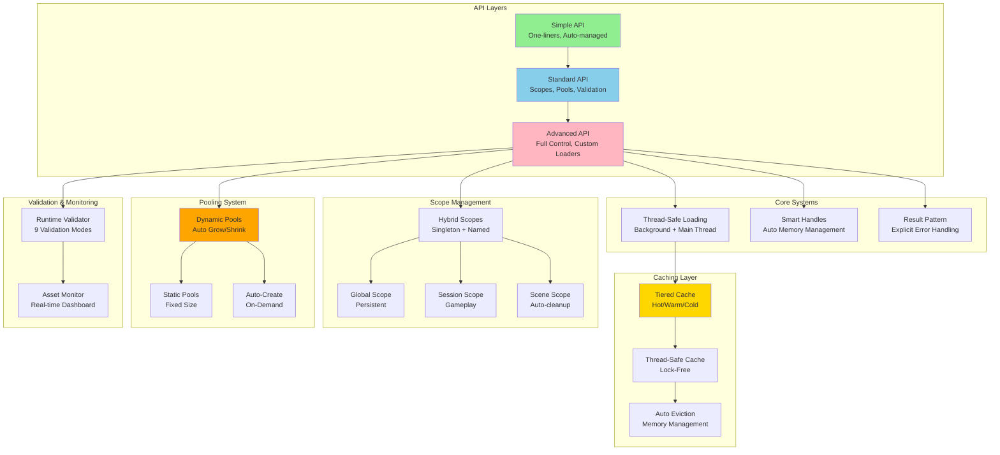
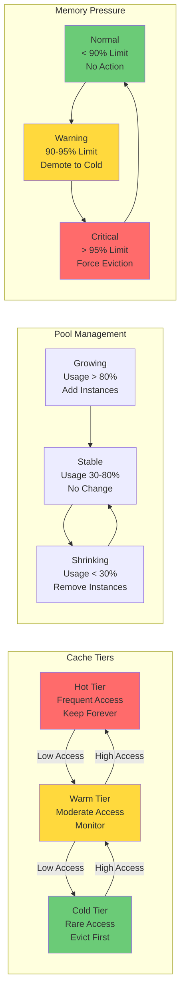
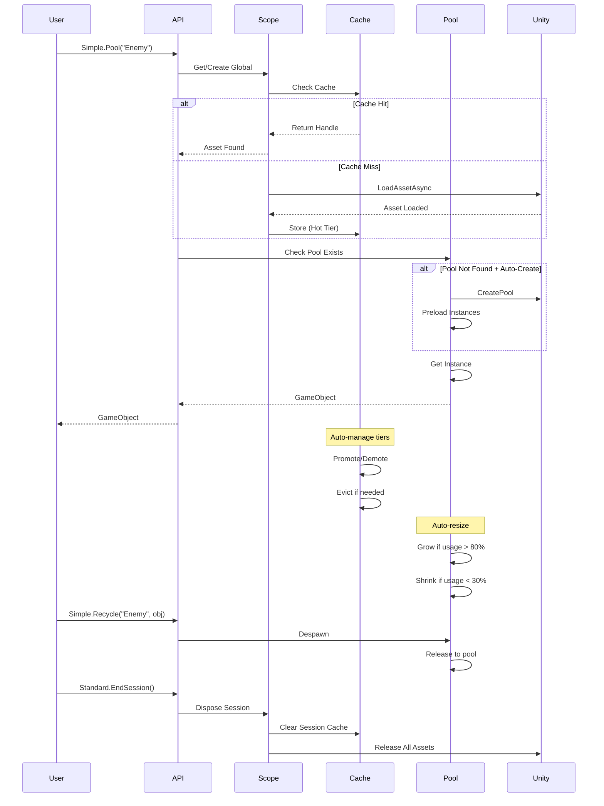

# Addressable Manager v3.5.0

**Enterprise-grade Unity Addressables management system** with 3-tier API, intelligent caching, complete thread-safety, automatic memory management, and **SmartAddresser-inspired rule-based automation**.

[](https://unity.com/)
[](CHANGELOG.md)
[](LICENSE)

> **NEW in v3.5**: Complete SmartAddresser-like automation system with rule-based configuration, visual editor tools, version management, and CI/CD integration!

---

## 🎯 Quick Start (Choose Your Level)

### Level 1: Simple API (Beginners)
```csharp
using AddressableManager.API;

// One-liner loading
var sprite = await Simple.Load<Sprite>("UI/Icon");

// Auto-managed pooling
var enemy = Simple.Pool("Enemies/Orc");
Simple.Recycle("Enemies/Orc", enemy);
```

### Level 2: Standard API (Production)
```csharp
using AddressableManager.API;

// Scoped loading
using var handle = await Standard.LoadGlobal<Sprite>("UI/Icon");
image.sprite = handle.Asset;

// Session management
Standard.StartSession();
var data = await Standard.LoadSession<LevelData>("Level1");
Standard.EndSession(); // Auto-cleanup

// Dynamic pools
await Standard.CreateDynamicPool("Enemies/Zombie", DynamicPoolConfig.Default);
var zombie = Standard.Spawn("Enemies/Zombie");
```

### Level 3: Advanced API (Experts)
```csharp
using AddressableManager.API;

// Custom tiered loader
var loader = Advanced.CreateTieredLoader("CustomScope", TieredCacheConfig.Aggressive);
var result = await Advanced.LoadWithResult<Sprite>(loader, "UI/Icon");

// Thread-safe loading
var threadSafeLoader = Advanced.CreateThreadSafeLoader("Background");
await Task.Run(async () => {
    var handle = await threadSafeLoader.LoadAssetAsync<Texture2D>("LargeTexture");
});

// Hybrid scopes
var player1 = Advanced.GetNamedScope("Session", "Player1");
var player2 = Advanced.GetNamedScope("Session", "Player2");
```

---

## 🤖 Automation System (NEW in v3.5!)

**SmartAddresser-inspired rule-based automation for addressable assets**

### Quick Automation Example

```csharp
// 1. Create rule asset: Right-click > Create > Addressable Manager > Layout Rule Data

// 2. Configure address rule
AddressRule uiSprites = new AddressRule {
    RuleName = "UI Sprites",
    Enabled = true,
    Priority = 100,
    TargetGroupName = "UI",
    Filters = new[] { new PathFilter("Assets/UI/**/*.png") },
    AddressProvider = new FileNameAddressProvider()
};

// 3. Apply rules
Window > Addressable Manager > Layout Rule Editor
> Select rule data > Click "Apply All"

// Result: All UI PNGs automatically configured!
```

### Automation Features

#### 🎯 Rule-Based Configuration
- **3 Rule Types**: Address, Label, Version
- **8 Filter Types**: Path, Type, Extension, Object, Address, Group, FindAssets, Dependencies
- **Multiple Providers**: Filename, Path, Folder, Constant, Git, Build Number, Date
- **Priority System**: Control rule processing order
- **Preview Mode**: See matches before applying

#### 🛠️ Visual Editor Tools
- **Layout Rule Editor**: Create and manage rules with live preview
- **Layout Viewer**: Visualize addressable layout, detect conflicts
- **Dashboard**: Real-time monitoring with memory graph
- **Debug Settings**: Configure runtime behavior

#### 📦 Version Management
- **Git Integration**: Version from commits/tags
- **Build Numbers**: Unity PlayerSettings integration
- **Timestamps**: Date-based versioning
- **Version Expressions**: Semantic version filtering (`[1.0.0,2.0.0)`)

#### ⚙️ CI/CD Integration
- **CLI Commands**: Batch processing for build pipelines
- **JSON Templates**: Shareable rule configurations
- **Import/Export**: Team collaboration
- **Validation**: Pre-apply rule checking

### Automation Workflow

```
1. Define Rules
   ↓ (PathFilter, TypeFilter, etc.)
2. Preview Matches
   ↓ (Check generated addresses/labels)
3. Apply Rules
   ↓ (Bulk configuration)
4. Verify Layout
   ↓ (Layout Viewer)
5. Build & Deploy
   ↓ (CLI automation)
```

### Documentation

- **[Automation Guide](Documentation/ADDRESSABLE_AUTOMATION_GUIDE.md)**: Complete 6000-word guide with concepts, workflows, and best practices
- **[Rule Examples](Documentation/RULE_SYSTEM_EXAMPLES.md)**: 8 copy-paste-ready examples for common scenarios
- **[Editor Tools Guide](Documentation/EDITOR_TOOLS_GUIDE.md)**: Detailed reference for all visual tools
- **[Troubleshooting](Documentation/TROUBLESHOOTING.md)**: Common issues and solutions

---

## 🏗️ Architecture Overview



---

## ✨ Key Features

### 🎨 3-Tier API Design
- **Simple API**: One-liner operations, perfect for prototyping
- **Standard API**: Production-ready with scope management
- **Advanced API**: Full control for framework builders

### 🔒 Complete Thread-Safety
- Load assets from **any thread** (background workers, async tasks)
- **Zero overhead** on main thread (direct passthrough)
- Lock-free data structures (ConcurrentDictionary + ReaderWriterLockSlim)

### 🧠 Intelligent Tiered Caching
- **Hot Tier**: Frequently accessed (keep in memory)
- **Warm Tier**: Moderately accessed (monitor)
- **Cold Tier**: Rarely accessed (evict first)
- Auto promote/demote based on access patterns

### 🎯 Smart Memory Management
- **SmartHandle**: Auto-dispose with C# `using` statements
- **GC Finalizer**: Safety net if dispose forgotten
- **Result<T> Pattern**: Explicit error handling (11 error codes)

### 🏊 Dynamic Pooling
- **Auto Grow**: Expands when usage exceeds threshold
- **Auto Shrink**: Contracts during sustained low usage
- **Auto Create**: Pools created on-demand
- **3 Presets**: Default, Aggressive, Conservative

### 🔄 Hybrid Scopes
- **Singleton Mode**: Simple global/session scopes
- **Named Instances**: Multiple independent scopes
- **Flexible**: Switch modes without code changes

### ✅ Runtime Validation
- **9 Validation Modes**: Address, AssetReference, Memory Leaks, etc.
- **3 Presets**: None, Development, Production, Full
- **Zero Cost**: Disabled in production builds

---

## 📖 Feature Comparison

| Feature | Simple API | Standard API | Advanced API |
|---------|-----------|--------------|--------------|
| One-liner loading | ✅ | ❌ | ❌ |
| Scope management | Auto | ✅ Manual | ✅ Custom |
| Thread-safe loading | ❌ | ❌ | ✅ |
| Tiered caching | ❌ | ❌ | ✅ |
| Smart handles | ❌ | ✅ | ✅ |
| Result pattern | ❌ | ✅ | ✅ |
| Dynamic pools | Auto | ✅ | ✅ |
| Validation | ❌ | ✅ | ✅ Full |
| Hybrid scopes | ❌ | ❌ | ✅ |
| Custom loaders | ❌ | ❌ | ✅ |
| Performance | Good | Great | Maximum |
| Learning curve | Easy | Medium | Advanced |

---

## 📚 Common Use Cases

### 🎮 Basic Asset Loading

```csharp
// Simple: Fire and forget
var sprite = await Simple.Load<Sprite>("UI/Icon");

// Standard: With scope control
using var handle = await Standard.LoadGlobal<Sprite>("UI/Icon");
image.sprite = handle.Asset;

// Advanced: With error handling
var result = await Advanced.LoadWithResult<Sprite>(loader, "UI/Icon");
if (result.IsSuccess) {
    using var handle = result.Value;
    image.sprite = handle.Asset;
} else {
    Debug.LogError($"Error: {result.Error.Message}\nHint: {result.Error.Hint}");
}
```

### 🏊 Object Pooling

```csharp
// Simple: Auto-create pool
var enemy = Simple.Pool("Enemies/Orc");
Simple.Recycle("Enemies/Orc", enemy);

// Standard: Configured pool
await Standard.CreateDynamicPool("Enemies/Orc", new DynamicPoolConfig {
    InitialCapacity = 10,
    MinSize = 5,
    MaxSize = 50,
    GrowThreshold = 0.8f,
    ShrinkThreshold = 0.3f
});
var orc = Standard.Spawn("Enemies/Orc");
Standard.Despawn("Enemies/Orc", orc);

// Advanced: Custom pool manager
var poolManager = Advanced.CreatePoolManager(loader);
Advanced.EnableAutoCreatePools(poolManager, DynamicPoolConfig.Aggressive);
var stats = Advanced.GetDynamicPoolStats(poolManager, "Enemies/Orc");
Debug.Log($"Pool: {stats.Value.ActiveCount}/{stats.Value.CurrentCapacity}");
```

### 🎬 Session Management

```csharp
// Standard API
Standard.StartSession();

// Load session-specific assets
var levelData = await Standard.LoadSession<LevelData>("Levels/Level1");
var enemies = await Standard.LoadSession<GameObject>("Enemies/Pack1");

// ... gameplay ...

// Clean up all session assets automatically
Standard.EndSession();
```

### 🧵 Thread-Safe Loading

```csharp
// Load from background thread
var loader = Advanced.CreateThreadSafeLoader("BackgroundLoader");

await Task.Run(async () => {
    // This works! Automatically dispatched to main thread
    var texture = await loader.LoadAssetAsync<Texture2D>("HugeTexture");
    var material = await loader.LoadAssetAsync<Material>("ComplexMaterial");
});
```

### 🏢 Multiple Player Sessions (Hybrid Scopes)

```csharp
// Create separate scopes for each player
var player1Scope = Advanced.GetNamedScope("Session", "Player1");
var player2Scope = Advanced.GetNamedScope("Session", "Player2");

// Each player has independent asset loading
var p1Weapon = await player1Scope.Loader.LoadAssetAsync<GameObject>("Weapons/Sword");
var p2Weapon = await player2Scope.Loader.LoadAssetAsync<GameObject>("Weapons/Axe");

// Clean up specific player
Advanced.ClearNamedScope("Session", "Player1");

// Or clean all player sessions
Advanced.ClearAllNamedScopes("Session");
```

### 🎯 Tiered Caching (Memory Optimization)

```csharp
// Create loader with aggressive caching (mobile-friendly)
var config = TieredCacheConfig.Aggressive; // 50MB max, quick eviction
var loader = Advanced.CreateTieredLoader("MobileScope", config);

// Pin critical assets to prevent eviction
Advanced.PinAsset<Sprite>(loader, "UI/CoreIcon");

// Load assets - automatically managed by tiers
var icon1 = await loader.LoadAssetAsync<Sprite>("UI/Icon1");
var icon2 = await loader.LoadAssetAsync<Sprite>("UI/Icon2");

// Get cache statistics
var stats = Advanced.GetCombinedCacheStats(loader);
Debug.Log($"Hot: {stats.HotEntries}, Warm: {stats.WarmEntries}, Cold: {stats.ColdEntries}");
Debug.Log($"Hit Rate: {stats.HitRate:P1}, Evictions: {stats.TotalEvictions}");

// Force eviction if needed
Advanced.ForceEviction(loader);
```

### ✅ Runtime Validation (Development)

```csharp
// Enable validation in development builds
#if DEVELOPMENT_BUILD || UNITY_EDITOR
    Standard.EnableValidation(ValidationMode.Development);
#else
    Standard.EnableValidation(ValidationMode.Production);
#endif

// Validation automatically checks:
// - Invalid addresses
// - Missing AssetReferences
// - Duplicate loads
// - Memory leaks
// - Thread safety violations
// - Unbalanced Retain/Release

// Get validation report
var stats = Standard.GetValidationStats();
Debug.Log($"Total loads: {stats.TotalLoads}, Duplicates: {stats.DuplicateLoadAddresses}");
```

### 🎨 Smart Handles (Auto Memory Management)

```csharp
// Old way: Manual memory management
var handle = await loader.LoadAssetAsync<Sprite>("UI/Icon");
handle.Retain();
// ... use sprite ...
handle.Release(); // Easy to forget!

// New way: Automatic with using statement
using var handle = await loader.LoadAssetAsync<Sprite>("UI/Icon").ToSmart();
// Auto-released when scope exits

// Or load directly as smart
using var smartHandle = await loader.LoadAssetSmartAsync<Sprite>("UI/Icon");

// Or with implicit conversion
Sprite sprite = await loader.LoadAssetAsync<Sprite>("UI/Icon").ToSmart();
```

---

## 🎓 API Progression Guide

### Start Here (Day 1)
```csharp
using AddressableManager.API;

// Learn Simple API first
var sprite = await Simple.Load<Sprite>("UI/Icon");
var enemy = Simple.Pool("Enemies/Orc");
```

### Production Ready (Week 1)
```csharp
using AddressableManager.API;

// Graduate to Standard API
Standard.StartSession();
using var handle = await Standard.LoadSession<Sprite>("UI/Icon");
await Standard.CreateDynamicPool("Enemies/Orc");
var orc = Standard.Spawn("Enemies/Orc");
Standard.EndSession();
```

### Optimization Phase (Month 1)
```csharp
using AddressableManager.API;

// Use Advanced API for fine-tuning
var loader = Advanced.CreateTieredLoader("Optimized", TieredCacheConfig.Aggressive);
Advanced.PinAsset<Sprite>(loader, "UI/Critical");

var threadSafeLoader = Advanced.CreateThreadSafeLoader("Background");
await Task.Run(() => threadSafeLoader.LoadAssetAsync<Texture2D>("Large"));

var player1 = Advanced.GetNamedScope("Session", "P1");
var player2 = Advanced.GetNamedScope("Session", "P2");
```

---

## 🔧 Configuration Examples

### Cache Configuration
```csharp
// Aggressive (Mobile/Low Memory)
var mobileConfig = TieredCacheConfig.Aggressive; // 50MB max

// Balanced (Most Cases)
var balancedConfig = TieredCacheConfig.Default; // 100MB max

// Lenient (PC/High Memory)
var pcConfig = TieredCacheConfig.Lenient; // 200MB max

// Custom
var customConfig = Advanced.CreateCacheConfig(
    maxSizeBytes: 150 * 1024 * 1024, // 150 MB
    promoteToHotThreshold: 20.0f,
    evictionTriggerRatio: 0.95f,
    enableAutoTiering: true,
    enableAutoEviction: true
);
```

### Pool Configuration
```csharp
// Default (Balanced)
var defaultPool = DynamicPoolConfig.Default;

// Aggressive (Memory Constrained)
var mobilePool = DynamicPoolConfig.Aggressive;

// Conservative (High Performance)
var pcPool = DynamicPoolConfig.Conservative;

// Custom
var customPool = Advanced.CreatePoolConfig(
    initialCapacity: 20,
    minSize: 10,
    maxSize: 200,
    growThreshold: 0.85f,
    shrinkThreshold: 0.25f,
    enableAutoResize: true
);
```

### Validation Configuration
```csharp
// Development: All checks
Standard.EnableValidation(ValidationMode.Development);

// Production: Critical only
Standard.EnableValidation(ValidationMode.Production);

// Full: Everything including verbose logging
Standard.EnableValidation(ValidationMode.Full);

// Custom: Mix and match
Advanced.SetValidationMode(
    ValidationMode.ValidateAddresses |
    ValidationMode.CheckMemoryLeaks |
    ValidationMode.CheckThreadSafety
);
```

---

## 🎯 Performance Characteristics

| Feature | Overhead | Best For |
|---------|----------|----------|
| Simple API | ~5% | Prototyping, small projects |
| Standard API | ~2% | Production, most games |
| Advanced API | ~0% | AAA, performance-critical |
| Thread-Safe Loading | 0% (main), ~10% (background) | Background loading |
| Tiered Cache | ~3% | Memory-constrained devices |
| Dynamic Pools | ~1% | Variable object counts |
| Smart Handles | ~1% | Preventing memory leaks |
| Result Pattern | ~2% | Better error handling |
| Validation (Dev) | ~5-15% | Development only |
| Validation (Prod) | ~1% | Critical checks only |

---

## 📊 Memory Management



---

## 🔄 Lifecycle Management



---

## 🛠️ Editor Tools

### Real-time Dashboard (Ctrl+Alt+A)
- **Assets Tab**: View all loaded assets, memory usage, reference counts
- **Performance Tab**: Cache hit rates, load times, memory graphs
- **Scopes Tab**: Active scopes, asset counts, memory per scope
- **Settings Tab**: Configure validation, cache limits, pool settings

### Custom Inspectors
- **Scope Components**: Live data, memory usage, asset lists
- **Pool Managers**: Pool statistics, active/pooled counts
- **Progress Bars**: Interactive testing controls

### Validation Reports
```csharp
// Get comprehensive diagnostics
var diagnostics = Advanced.GetSystemDiagnostics();
Debug.Log(diagnostics); // Full system report

// Scope statistics
var scopeStats = Advanced.GetHybridScopeStats();
Debug.Log($"Scopes: {scopeStats.TotalScopes}, Cached: {scopeStats.TotalCachedAssets}");

// Cache statistics
var cacheStats = Advanced.GetCombinedCacheStats(loader);
Debug.Log($"Hit Rate: {cacheStats.HitRate:P1}, Size: {cacheStats.TotalSizeBytes / 1024 / 1024}MB");
```

---

## 🎓 Migration Guide

### From v2.x to v3.0

**No Breaking Changes!** All v2.x code continues to work.

```csharp
// v2.x code still works
var handle = await Assets.Load<Sprite>("UI/Icon");
Assets.Release(handle);

// But you can upgrade incrementally:

// Step 1: Use Standard API
using var handle = await Standard.LoadGlobal<Sprite>("UI/Icon");

// Step 2: Add Smart Handles
using var smartHandle = await loader.LoadAssetSmartAsync<Sprite>("UI/Icon");

// Step 3: Use Result Pattern
var result = await loader.LoadAssetAsyncSafe<Sprite>("UI/Icon");

// Step 4: Enable Validation
Standard.EnableValidation(ValidationMode.Development);

// Step 5: Use Tiered Caching
var loader = Advanced.CreateTieredLoader("Optimized");
```

### From Assets Static Class

```csharp
// Old
var sprite = await Assets.Load<Sprite>("UI/Icon");

// New (choose your level)
var sprite = await Simple.Load<Sprite>("UI/Icon");           // Simplest
using var handle = await Standard.LoadGlobal<Sprite>("UI/Icon"); // Standard
var result = await Advanced.LoadWithResult<Sprite>(loader, "UI/Icon"); // Advanced
```

---

## 🐛 Troubleshooting

### Common Issues

**1. Thread Safety Violation**
```
Error: AssetLoader must be called from Unity's main thread
Solution: Use ThreadSafeAssetLoader or Advanced.CreateThreadSafeLoader()
```

**2. Memory Leaks**
```
Warning: High reference count detected: UI/Icon has ref count 15
Solution: Use SmartHandle with 'using' statement or enable validation
```

**3. Pool Not Found**
```
Error: No pool found for Enemies/Orc
Solution: Enable auto-create with poolManager.EnableAutoCreatePools()
```

**4. Cache Full**
```
Warning: Cache size exceeds maximum (150MB / 100MB)
Solution: Use TieredCache with aggressive config or increase MaxCacheSizeBytes
```

---

## 📦 Installation

1. Add package via Package Manager:
```
https://github.com/your-repo/addressable-manager.git
```

2. Or add to `manifest.json`:
```json
{
  "dependencies": {
    "com.game.addressables": "3.0.0"
  }
}
```

3. Requirements:
   - Unity 2021.3+
   - Addressables 2.3.1+
   - TextMeshPro 3.0.6+

---

## 📝 Version History

### v3.0.0 - Major Rewrite
- **NEW**: 3-Tier API (Simple/Standard/Advanced)
- **NEW**: Complete thread-safety with lock-free structures
- **NEW**: Intelligent tiered caching (Hot/Warm/Cold)
- **NEW**: Hybrid scopes (Singleton + Named instances)
- **NEW**: Advanced diagnostics and system stats

### v2.5.0 - Architecture Improvements
- **NEW**: Tiered cache system
- **NEW**: Hybrid singleton pattern
- **NEW**: Runtime validation (9 modes)
- **NEW**: Auto-create pool functionality

### v2.2.0 - Enhanced Features
- **NEW**: Thread-safe loading
- **NEW**: SmartAssetHandle (auto memory management)
- **NEW**: Result<T> pattern (explicit errors)
- **NEW**: Dynamic pools (auto grow/shrink)

### v2.1.0 - Automatic Monitoring
- **NEW**: All loads automatically tracked
- Simplified API (no more .Monitored suffix)

### v2.0.0 - Editor Tools & Monitoring
- **NEW**: Real-time Dashboard
- **NEW**: Custom inspectors
- **NEW**: Configuration system

---

## 🤝 Support

- **Documentation**: [EDITOR_TOOLS_GUIDE.md](EDITOR_TOOLS_GUIDE.md), [MONITORING_GUIDE.md](MONITORING_GUIDE.md)
- **Changelog**: [CHANGELOG.md](CHANGELOG.md)
- **Issues**: [GitHub Issues](https://github.com/your-repo/issues)

---

## 📄 License

MIT License - See [LICENSE](LICENSE) file

---

**Made with ❤️ for Unity Developers**

*Addressable Manager v3.0 - From prototyping to production, one API at a time.*
